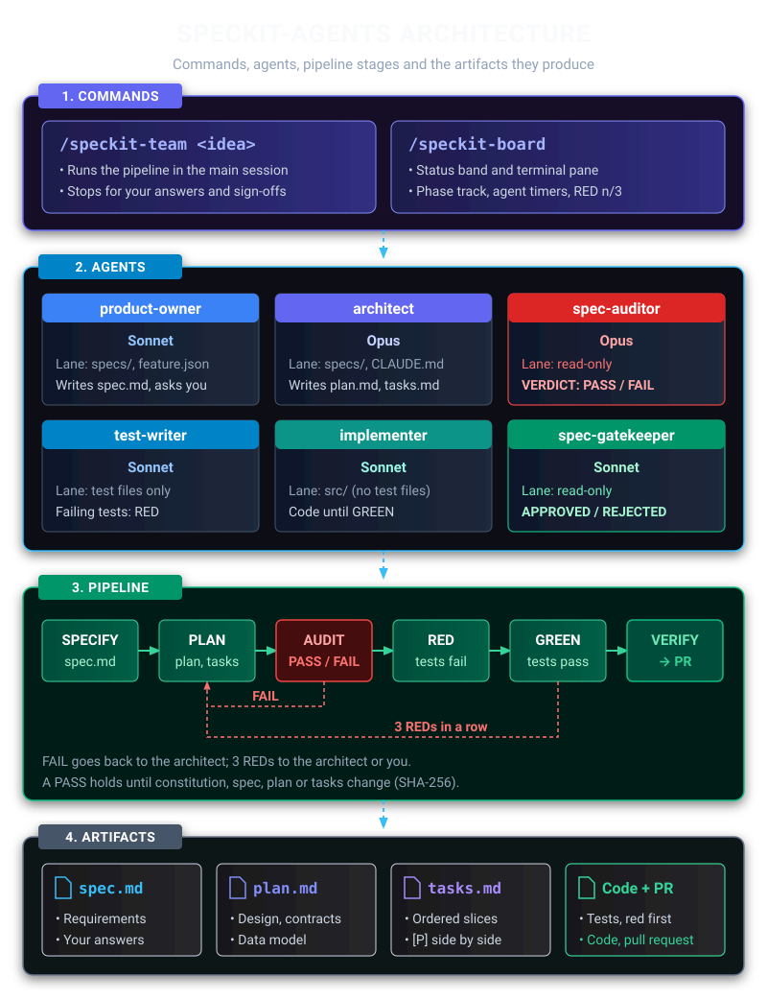
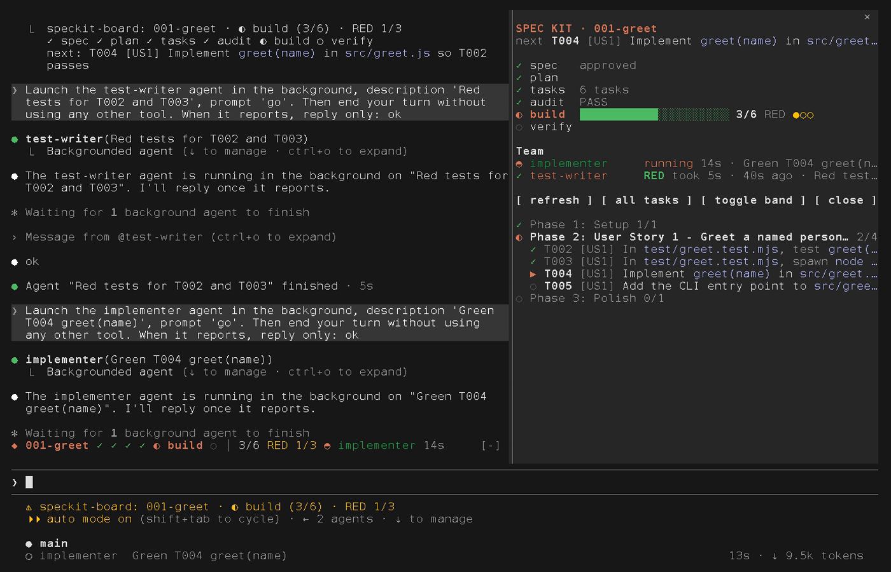

<div align="center">

# speckit-agents

**A Claude Code subagent team for GitHub Spec Kit, with the rules enforced by hooks.**

[](https://github.com/PIsberg/speckit-agents/actions/workflows/test.yml)
[](https://code.claude.com/docs/en/sub-agents)
[](https://github.com/github/spec-kit)
[](https://nodejs.org)
[](.github/workflows/test.yml)

[Install](#install) · [Quick start](#quick-start) · [The team](#the-team) · [How it works](#how-it-works) · [The fast track](#the-fast-track) · [Board mod](#board-mod-experimental) · [Troubleshooting](#troubleshooting)

</div>

A team of seven [Claude Code subagents](https://code.claude.com/docs/en/sub-agents) that carries a
feature through [GitHub Spec Kit](https://github.com/github/spec-kit), from idea to pull request.
Six of them each own one phase. [Hooks](https://code.claude.com/docs/en/hooks), not prompt text, keep
each one in its lane: the planner cannot write code, the implementer cannot touch tests, and
nobody writes code until an independent auditor has passed the spec. The seventh, `patcher`, is a
fast track beside the pipeline for a change of at most 30 production lines in 2 files
(`/speckit-patch`), with no spec, plan or audit; hooks keep it inside that budget too.

```
idea ─► product-owner ─► architect ─► spec-auditor ─► per slice: stubs ─► red ─► green ─► spec-gatekeeper ─► PR
        spec.md          plan.md      VERDICT:        implementer  test-writer  implementer  APPROVED /
        + questions      tasks.md     PASS / FAIL                                  │         REJECTED
           ▲                ▲              │                                       │
           └── you answer   └── findings routed back on FAIL ◄── 3 REDs in a row ──┘
```

## Highlights

- **One agent per phase.** product-owner specifies, architect plans, spec-auditor audits,
  test-writer and implementer build test-first, spec-gatekeeper checks the result. Each one's
  phase instructions are Spec Kit's own skill. ([The team](#the-team))
- **Lanes are hooks, not requests.** A `Write` or `Edit` outside an agent's lane is denied before
  the file exists, and the denial tells the agent whose lane it is in; a change made through Bash
  is caught when the agent stops. ([Guardrails](#guardrails), [The lane check](#the-lane-check))
- **No code before the audit.** A PASS is tied to a SHA-256 fingerprint of the constitution,
  spec, plan and tasks, and any edit to them other than ticking a task voids it.
  ([The audit gate](#the-audit-gate))
- **Test-first, one slice at a time.** Stubs, then tests shown failing on an assertion, then the
  code that turns them green. ([Building in slices](#building-in-slices))
- **A retry limit.** After 3 `RESULT: RED` reports in a row, implementer is denied every tool but
  reporting back, and the way forward is a revised plan and a new audit.
  ([The retry limit](#the-retry-limit))
- **You decide at three stops, and you merge.** The pipeline asks you to answer the spec's
  questions, approve the spec, and approve the plan, then stops at the pull request.
  ([Quick start](#quick-start))
- **A fast track for small changes.** `/speckit-patch <change>` launches one agent, `patcher`, with a
  budget of 30 production lines and 2 files, protected paths it cannot write, and no commit of its
  own: the main session commits its files, and opens the PR, only after an end-of-run hook check
  accepts the run. ([The fast track](#the-fast-track))
- **Free everywhere else.** Installed once for your user; in a repo without `.specify/` every hook
  exits immediately and allows the action. ([Guardrails](#guardrails))

## Contents

- [Getting started](#getting-started)
  - [Requirements](#requirements)
  - [Install](#install)
  - [Quick start](#quick-start)
- [What it looks like](#what-it-looks-like)
- [The team](#the-team)
- [Why This Architecture Succeeds](#why-this-architecture-succeeds)
- [How it works](#how-it-works)
  - [The pipeline skill](#the-pipeline-skill)
  - [The fast track](#the-fast-track)
  - [Guardrails](#guardrails)
  - [The audit gate](#the-audit-gate)
  - [The retry limit](#the-retry-limit)
  - [The lane check](#the-lane-check)
  - [Test files](#test-files)
  - [State](#state)
  - [Context budget](#context-budget)
- [Customising](#customising)
- [Board mod (experimental)](#board-mod-experimental)
- [Verifying](#verifying)
  - [Test suite](#test-suite)
  - [CI](#ci)
  - [End-to-end tests](#end-to-end-tests)
  - [Live check](#live-check)
  - [Live results](#live-results)
- [Troubleshooting](#troubleshooting)
- [Known limits](#known-limits)
- [Uninstall](#uninstall)
- [Developing](#developing)

## Getting started

### Requirements

| Tool | Why | Check |
|---|---|---|
| [Claude Code](https://code.claude.com) | runs the agents. Needs subagent frontmatter `hooks:` and `skills:`, and the `UserPromptExpansion` hook event (verified on 2.1.291) | `claude --version` |
| [Node](https://nodejs.org) 18+ | every hook is a Node script | `node --version` |
| [git](https://git-scm.com) | the hooks use it to find the repo and diff an agent's work | `git --version` |
| [Spec Kit](https://github.com/github/spec-kit) (`specify`) | per repo, provides the phase skills | `specify --version` (verified on 0.8.11 and 1.1.2) |
| [uv](https://docs.astral.sh/uv/) | installs Spec Kit, a Python tool; nothing in this repo runs on it | `uv --version` (verified on 0.11.14) |

#### Installing uv and Spec Kit

uv is not preinstalled on macOS or Windows. Install it, then Spec Kit:

```sh
# macOS (or: brew install uv) and Linux
curl -LsSf https://astral.sh/uv/install.sh | sh
# Windows, in PowerShell (or: winget install --id=astral-sh.uv)
powershell -ExecutionPolicy ByPass -c "irm https://astral.sh/uv/install.ps1 | iex"

uv tool install specify-cli --from git+https://github.com/github/spec-kit.git
```

Spec Kit needs Python 3.11 or newer; uv downloads one if the machine has none. Open a new
terminal after installing uv so `uv` and `specify` are on `PATH`.

### Install

```sh
git clone https://github.com/PIsberg/speckit-agents.git && cd speckit-agents
./setup.sh                                               # macOS, Linux, Git Bash
powershell -ExecutionPolicy Bypass -File setup.ps1       # Windows PowerShell
node install.mjs                                         # anywhere Node runs
```

> [!IMPORTANT]
> Restart Claude Code afterwards: agents are loaded at session start.

#### What gets installed

The installer puts everything in your user-level Claude Code directory (`$CLAUDE_CONFIG_DIR`, or
`~/.claude`), so the team is available in every repository:

| Installed file | What it is |
|---|---|
| `agents/{product-owner,architect,spec-auditor,test-writer,implementer,spec-gatekeeper,patcher}.md` | the seven subagents |
| `skills/speckit-team/SKILL.md` | the `/speckit-team` command that runs the pipeline |
| `skills/speckit-patch/SKILL.md` | the `/speckit-patch` command that runs the [fast track](#the-fast-track) |
| `skills/speckit-triage/SKILL.md` | the advisory `/speckit-triage` command: suggests which of the two to use, runs nothing |
| `hooks/speckit-team.mjs` | every guardrail |
| `settings.json` | two hook entries merged in; your other settings and hooks are kept |

#### Installer options

| Flag | Effect |
|---|---|
| `--dry-run` | print what would change, write nothing |
| `--force` | replace same-named agents you wrote yourself (each is kept as `*.bak-speckit-agents` and put back on uninstall) |
| `--claude-dir DIR` | install into `DIR` instead of `~/.claude` |
| `--uninstall` | remove everything the installer wrote, and nothing else ([Uninstall](#uninstall)) |
| `--board` | also install the experimental [board mod](#board-mod-experimental); later reruns keep it |
| `--no-board` | remove the board mod and keep the team |

There is no flag for the fast track: `patcher` and its two skills are always installed.

#### How the installer treats your files

- **Idempotent.** Rerun it after pulling changes.
- **In place.** It changes `settings.json` in place, keeping the file's own indentation and line
  endings, and updates its gate entries where they stand, so a rerun after another tool re-sorted
  the file changes nothing.
- **One backup.** The first time it changes your settings it keeps one copy of the original as
  `settings.json.bak-speckit-agents`.
- **Validates first.** It refuses to touch a `settings.json` that is not valid JSON or not a
  settings object (an array, or a `hooks` entry that is not a list of objects), and stops before
  writing anything.
- **Keeps a record.** It records what it created in `hooks/speckit-agents.install.json`.
- **Smoke-tests the hook.** It finishes by running the installed hook once, so a broken Node setup
  fails the install instead of silently disabling the guardrails.

### Quick start

#### 1. Set up a repository

In a repository:

```sh
specify init --here --integration claude
```

> [!NOTE]
> Keep `--integration claude`: without it, Spec Kit asks which assistant to set up, or, when it
> cannot ask, sets up GitHub Copilot, and the team then finds none of Spec Kit's skills. Spec Kit
> 0.10 removed the older `--ai claude` spelling.

On Spec Kit 1.x you can add `--extension git` to have Spec Kit name and create each feature
branch; without it, `/speckit-team` creates the branch itself after the spec is written. (Spec Kit
0.8 installs that extension by default and rejects the flag.)

#### 2. Run the pipeline

Then, in Claude Code:

```
/speckit-team Let users export their reading list as CSV
```

`/speckit-team` runs the whole pipeline from the main session. It stops for you at three points:

1. to answer the product owner's questions;
2. to approve the spec;
3. to approve the plan and tasks. If `tasks.md` has two or more `[P]` slices that touch disjoint
   files, this stop also asks whether to build them side by side or one at a time.

In a repo whose constitution (the rules every phase is checked against) is still Spec Kit's
template, it first drafts one from what the repo already states (`CLAUDE.md`, the build file, CI)
and asks you to approve it, a fourth stop, then writes it with `speckit-constitution` and commits
it on the feature branch, not on main. You can still run `/speckit-constitution` yourself
beforehand.

After that it audits, then builds the feature one slice at a time (stubs, failing tests, code),
verifies and opens a PR, which it does not merge.

#### 3. A small change: the fast track

For a typo, a config value or a small bug fix, skip the pipeline:

```
/speckit-patch Fix the typo "recieve" in README.md
/speckit-triage Add a --json flag to the export command
```

`/speckit-patch` creates the branch `patch/<slug>` and launches `patcher` once. The hooks hold it
to 30 production lines in 2 files (tests and docs are not counted) and keep it out of protected
paths such as `specs/`, `.specify/`, `.claude/` and `.github/`. `patcher` ends with one of three
words: `DONE` (the existing tests passed), `FAILED`, or `ESCALATE` (over budget or in need of a
protected file: the work stays uncommitted and `/speckit-team` is the way on).

Who commits: `patcher` never does. After `DONE` and an end check that accepts the run, the main
session commits the files `patcher` changed, pushes the branch and opens a PR, which it does not
merge. A run in which `patcher` changed no file commits nothing and opens no PR. Files you had
uncommitted before the run are left out of the commit.

`/speckit-triage <request>` only prints one line suggesting `/speckit-patch` or `/speckit-team`;
it launches nothing and you type the command. How the budget and the checks work:
[The fast track](#the-fast-track).

#### Running one phase

You can also run one phase at a time by @-mentioning an agent:

```
@agent-spec-auditor audit the active feature
@agent-implementer do T007 and T008
```

## What it looks like

Real sessions in a scratch Spec Kit repo, the main session on Haiku
([`record.mjs`](docs/media/record.mjs) now puts every agent on Haiku too; before
[#39](https://github.com/PIsberg/speckit-agents/issues/39) they ran on their own models), so your
runs will word things differently. The three recordings that wait on agents are sped up 2x or 4x.
`node docs/media/record.mjs` records them again (see
[Recording the demo media](#recording-the-demo-media)).

### The team in the `@` typeahead

Typing `@` lists the agents Claude Code knows, each with its description, after the repo's
folders. Claude Code 2.1.296 stops the list at 15 entries, so it shows six of the team's seven
among Claude Code's own five agents: test-writer, last in alphabetical order, is left out. Claude Code
2.1.295 removed the `/agents` menu this section used to show.


### A subagent at work

`@agent-spec-auditor` audits a feature inside the main session: the collapsed progress view, the
full transcript with Ctrl+O, then the `VERDICT:` it hands back, which a hook records for the
implementation gate.


### A guardrail firing

architect is told to write `src/greet.js`. Its scope hook denies the write before the file exists,
and the denial tells the agent whose lane production code is in.


### The pipeline

`/speckit-team` launches product-owner, which writes the spec and returns its questions, and the
main session puts them to you: the first of the pipeline's three stops.


## The team

| Agent | Spec Kit phase | May write | Hands over | Model |
|---|---|---|---|---|
| [`product-owner`](agents/product-owner.md) | specify, clarify | `specs/`, `.specify/feature.json` | `spec.md` and up to 5 questions with recommended answers | sonnet |
| [`architect`](agents/architect.md) | plan, tasks | `specs/`, `CLAUDE.md` | `plan.md`, `data-model.md`, `contracts/`, `tasks.md`, with the minimal design that meets the spec | opus |
| [`spec-auditor`](agents/spec-auditor.md) | analyze | nothing | `VERDICT: PASS` or `FAIL`; FAIL only on CRITICAL or HIGH findings, MEDIUM and LOW are listed and accepted | opus |
| [`test-writer`](agents/test-writer.md) | TDD red | test files, `tasks.md` | committed tests, each shown failing on an assertion, never on a parse, import or compile error; the report ends `RED`, or `BLOCKED` with what stopped it | sonnet |
| [`implementer`](agents/implementer.md) | stubs, TDD green | anything except test files and `.specify/` | signature stubs (`RESULT: STUB`), or committed code with the suite green (`RESULT: GREEN` / `RED`) | sonnet |
| [`spec-gatekeeper`](agents/spec-gatekeeper.md) | final check | nothing | `APPROVED` or `REJECTED`, with a requirement-to-test table | sonnet |
| [`patcher`](agents/patcher.md) | fast track | the working tree except protected paths, within 30 production lines and 2 files, never a commit | a report that `/speckit-patch` commits from, ending `DONE`, or `ESCALATE` or `FAILED` | sonnet |

Each agent's phase instructions are Spec Kit's own skill (`speckit-plan` and so on), preloaded
into the agent with the `skills:` frontmatter field. The agent file adds only what Spec Kit does
not say: its inputs, its lane, and the shape of its report. Those bodies are 26 to 43 lines on
purpose. `patcher` is the exception to the preloaded skill: it runs no Spec Kit phase, so its
31-line body carries the whole job.

### Why the prompts are short

A long prompt dilutes the rules that matter, and a rule in prose is a request. "Never edit tests"
in a prompt will hold most of the time. A hook that rejects the edit holds every time, and its
rejection message tells the agent what to do instead.

### Why each agent has a narrow description

Claude Code puts every agent's description into every session so it can route work. These seven
total about 1,900 characters (1,872 counted in the `description:` lines), about 470 tokens. The token figure is an estimate, not a measurement: 1,872 characters at the usual 4 characters per token for English text (counting tokens needs a model call, which was not made). Each one says when to use the agent and what it
will not do, so routing does not have to guess.

## Why This Architecture Succeeds



**Prevents "Garbage In, Garbage Out":** Most agent pipelines fail because the initial spec is
vague, and the coding agent fills in the blanks with hallucinations. Your product-owner forcing a
human-in-the-loop Q&A step before architecture ensures the foundation is solid.

**True TDD Validation:** LLMs are notoriously bad at writing tests for code they just wrote; they
tend to write tautological tests that just mock everything to ensure a pass. Forcing the
test-writer to write failing tests first proves the agent actually understands the acceptance
criteria.

**Circuit Breakers:** The spec-auditor acts as a firewall. If the architect designs a plan that
violates the spec, it gets kicked back before you waste tokens and time generating useless code.

**Role-Based Access Control (RBAC):** Using hooks to enforce file-system permissions per agent is
the most reliable way to orchestrate multi-agent systems today.

## How it works

Two commands, both skills that run in the main session: [`/speckit-team`](skills/speckit-team/SKILL.md)
launches each agent of the pipeline in turn, and [`/speckit-patch`](skills/speckit-patch/SKILL.md)
launches `patcher` once. Every rule that must hold is a mode of one hook script,
[`hooks/speckit-team.mjs`](hooks/speckit-team.mjs): the skill decides what happens next, and the
hooks decide what is allowed.

### The pipeline skill

`/speckit-team` runs in the main session, because only the main session can talk to you. It
launches each agent with the inputs it needs and relays the product owner's questions to you.

#### Routing findings

On a FAIL it routes each CRITICAL and HIGH finding to the agent that owns it; MEDIUM and LOW
findings are accepted and listed once at hand-over. On a REJECTED it routes each reason the same
way. After two failed audits it hands the findings to you.

#### Building in slices

After the audit it builds the feature one slice at a time, never in one shot. A slice is one small
implementation task plus the test tasks that cover it, and the architect writes `tasks.md` in
those slices. For each slice:

1. **Stubs.** If the tests will call code that does not exist yet, implementer first creates the
   signatures the task lists, with bodies that only signal "not implemented", and reports
   `RESULT: STUB`. This is what lets the next step fail cleanly.
2. **Red.** test-writer writes the slice's tests and loops until each one fails on an assertion
   or on the stub's not-implemented signal. A test that fails because it does not parse, an
   import is missing or a name is undefined proves nothing about the behaviour, so test-writer
   fixes it (at most 3 rounds per test) and the skill sends back any that still fail that way.
3. **Green.** implementer makes the slice's tests pass, under the [retry limit](#the-retry-limit).

The failure-reason check in step 2 is prose: the hooks cannot tell an assertion failure from a
compile error in an arbitrary language, so the skill checks test-writer's pasted output.

When the last slice is GREEN and every task in `tasks.md` is ticked, it launches spec-gatekeeper
straight away, without asking: between the stops above it never waits for you. A task still
unticked at that point (a final test run, say) becomes one more implementer slice, and the ticks
made while building never void the audit.

#### Parallel slices

For `[P]` slices touching disjoint files, it can run several loops at once, each implementer in its
own git worktree, merged back into the feature branch in task order. It does so only if you say so
at the plan stop, and it recommends one at a time until a live run has confirmed side-by-side
launches ([#40](https://github.com/PIsberg/speckit-agents/issues/40)). Side by side saves
wall-clock time, not tokens: every slice gets its own test-writer and implementer either way, plus
a few main-session requests for the merges, and several agents then draw on your usage limits at
once.

#### Handoffs are lossy on purpose

A subagent never sees the main session's conversation; it starts with the prompt the skill writes
and whatever files it reads. So the skill passes each agent only what its Inputs section lists,
and never the chat, the product owner's questions and answers, or another agent's full report.
implementer gets the slice's task IDs and test-writer's report for them, and its own prompt tells
it to read `tasks.md`, the failing tests and the code they touch, not `spec.md`, `plan.md`,
`research.md` or `data-model.md`. The tests are its spec.

### The fast track

`/speckit-patch <change>` is for a change too small for the pipeline. One run:

1. The skill (main session) checks that `.specify/` exists, notes the start commit and the
   installed hook's hash, and creates `patch/<slug>` from the current commit.
2. It launches `patcher` once, in the foreground. `patcher` changes the working tree and runs the
   repo's existing tests, and a hook measures it on every tool call.
3. When `patcher` reports, the end check decides whether the run is accepted (see below).
4. Only if it is, and the report is `DONE` with the tests passed, the skill commits the files in the
   accepted record, pushes `patch/<slug>` (never forced) and opens a PR if there is a GitHub remote.
   It does not merge. `patcher` itself cannot commit, push or run `gh`.

So the skill decides what happens next and the hooks decide what is allowed, as in the pipeline. A
commit made before the end check would hold whatever the run did, and a push cannot be undone; this
way nothing leaves the working tree until the check has looked at the whole run.

#### The budget

At most 30 changed production lines in at most 2 production files; 30 is within and 31 is over. No
binary production file. The hook measures against the commit the run started from:

- Per production file, the larger of its insertions and deletions in `git diff --numstat`, so a
  modified line counts once and 30 modified lines fit. An untracked production file counts its
  lines.
- A rename between production files is 1 file and only its edited lines, so a pure rename is 0
  lines. A test or doc moved into production code counts as a new production file. A move git does
  not pair as a rename, such as a plain `mv`, counts as a deletion plus a new file, which is why
  `patcher` moves files with `git mv`.
- Files already uncommitted at the start are left out while they stay unchanged. A `Write` or `Edit`
  to one is denied. A change to one by other means, or a commit containing one, stops the run: it
  is over budget because the hook cannot separate your lines from `patcher`'s.

Over budget, every tool except reporting back is denied and `patcher` ends `ESCALATE`. If a protected
file was changed or a commit was made, it may still restore: a Bash command that is one
`git checkout`, `git restore`, `git reset --soft` or `rm`, naming only protected files still to be
restored.

#### Path classes

Each changed path gets one class, checked in this order:

1. **Protected**: never written (the table below).
2. **Test**: the [built-in patterns](#test-files) plus `.specify/test-paths` as committed at the
   start commit, not as it is in the working tree, so commit a change to that file before a run.
3. **Doc**: a file ending `.md`, `.mdx`, `.markdown`, `.rst`, `.adoc`, `.asciidoc`, or a `.txt` file under `docs/` or named
   `README`, `CHANGELOG`, `CHANGES`, `HISTORY`, `NEWS`, `LICENSE`, `NOTICE`, `AUTHORS`, `CONTRIBUTING`
   or `COPYING` (any directory), all case-insensitive. Any other `.txt` file, such as
   `requirements.txt` or `CMakeLists.txt`, is production.
   A `docs/` folder is not a doc rule for other files: a `.js` file in it is production.
4. **Production**: anything else. Only production counts against the budget.

| Protected path | Why |
|---|---|
| `.specify/` | Spec Kit's config and the constitution |
| `specs/` | feature specs, plans and tasks, which belong to `/speckit-team` |
| `.claude/` | the project's Claude Code agents, skills, hooks and settings |
| `.github/` | CI workflows and repository settings |
| `.gitlab-ci.yml`, `.circleci/`, `azure-pipelines.yml`, `Jenkinsfile`, `.pre-commit-config.yaml` | other CI and commit-hook configuration |

The speckit-agents sources (`hooks/speckit-team.mjs`, `agents/*.md`, `skills/*/SKILL.md`,
`install.mjs`) and the top-level `package.json` are protected too, but only in a repository whose
top-level `package.json`, as committed at the start, is named `speckit-agents`. Elsewhere those are
ordinary files. The installed team in the Claude config directory (`agents/`, `hooks/`, `skills/`,
`settings.json`, `settings.local.json`) is protected everywhere: a `Write` or `Edit` there is denied,
and any other change is caught at the end.

#### What the hooks stop

- **Writes** (`scope protected`): a `Write`, `Edit`, `MultiEdit` or `NotebookEdit` to a protected
  path, the installed team or the git directory is denied before it runs.
- **History and remote commands**: `patcher` may not run `git commit`, `merge`, `rebase`, `stash`,
  `tag`, `branch`, `switch`, `push`, `pull`, `fetch`, a `git checkout` with no `--` and the other
  subcommands in `HISTORY_SUBCOMMANDS`, nor `gh` or `hub`. The command is split into words and every
  `git` word is checked, so `sh -c "git push"` and `git -C . commit` are caught.
- **Wholesale restores**: `git reset --hard`, `git clean`, and a `git checkout` or `git restore` of
  `.`, a folder, a pattern or a file uncommitted at the start are denied on every Bash call, because
  they would destroy your uncommitted work.

#### The end check

When `patcher` finishes, the hook measures the run and the first rule that applies decides:

| What it finds | Result |
|---|---|
| a protected repo file changed | blocks `patcher` from finishing until each is restored, on every attempt |
| a commit made since the start | blocks until `git reset --soft <start>` |
| an installed team file changed | the run ends `FAILED`: `patcher` may finish, nothing is committed |
| over budget | `patcher` may finish; the run is not accepted, nothing is committed |
| within budget | accepted: the hook writes the accepted record |

The protected check blocks every time, repo files only, because `patcher` can restore a repo file by
naming it. It cannot restore a file outside the repo, and blocking would leave no way out but
stopping the run by hand, so a changed team file ends the run `FAILED` instead, with a message naming
the files. In both cases there is no accepted record, so the skill commits nothing.

The accepted record, `patch-accepted.json`, lists the files `patcher` changed (production, test and
doc, never a protected file or one that was uncommitted at the start) and which of them are
untracked. The skill commits exactly those with `git commit -- <files>`, which leaves your other
staged changes out of the commit. If `files` is empty, `patcher` changed nothing and the skill
commits nothing, pushes nothing and opens no PR. The skill also checks that the installed hook's hash,
`HEAD` and the branch are as it left them.

#### What is prompt text, and what was verified

No hook can tell which command is a repo's test suite or whether it passed. These are rules in
[`agents/patcher.md`](agents/patcher.md) and
[`skills/speckit-patch/SKILL.md`](skills/speckit-patch/SKILL.md), not hooks: no PR unless the
existing tests passed, reporting tests as passed, failed, skipped or not run, a regression test
first for a change in behaviour, and never merging. The hook's part is that no accepted record exists
unless the end check accepted the run.

- **Verified live (2026-10-10, Claude Code 2.1.296, [Live results](#live-results)):** one fix
  through to a commit by the main session on a branch the skill created, with the end check's
  `fast track ... accepted` message (L1, L8); `FAILED` on a change that breaks a test, with no commit
  (L2); a write to a protected path denied and reported `ESCALATE` (L4); a new workflow file blocked
  at the stop, deleted, and left out of the commit (L5); `/speckit-triage` launching no agent (L6);
  the `/speckit-implement` gate unchanged (L7); and, over budget, the end check's message and no
  accepted record (L3). Run with a Haiku main session, headless, on a repo with no remote, so no
  push or pull request was made.
- **Seen live, but not as the checks expected:** `/speckit-triage fix a typo in README.md`
  suggested `/speckit-team` instead of `/speckit-patch` (L6, failed); the mid-run budget deny
  never fired because the model wrote everything in one Bash call, and its report ended `DONE`,
  not `ESCALATE` (L3); the deny of `patcher`'s own `git commit` and `git push` never fired because
  the model never tried one, so it rests on the unit and end-to-end tests (L8).
- **Verified by unit and end-to-end test only:** every hook decision above in
  [`test/hook.test.mjs`](test/hook.test.mjs); the installed agent and skills in
  [`test/install.test.mjs`](test/install.test.mjs); the three hook entries of `patcher` firing under
  `claude -p` against a fake API in [`test/e2e.test.mjs`](test/e2e.test.mjs).
- **Not verified at all:** a real model following the prompt rules above, and whether Claude Code
  delivers `patcher`'s hooks in an interactive session (every live run was headless, `claude -p`).

The hooks guard against an agent's mistakes and drift, not against deliberate evasion through the
shell. What that leaves open is in [Known limits](#known-limits).

### Guardrails

Every guardrail is a mode of [`hooks/speckit-team.mjs`](hooks/speckit-team.mjs). In a repo without
`.specify/` every mode exits immediately and allows the action, so installing at user level costs
nothing elsewhere.

| Mode | Wired to | What it stops |
|---|---|---|
| `scope only <prefixes>` | product-owner, architect: PreToolUse `Write\|Edit\|MultiEdit\|NotebookEdit` | writing outside their prefixes |
| `scope tests` | test-writer: same | writing production code |
| `scope no-tests` | implementer: same | writing test files, or Spec Kit's config under `.specify/` (`feature.json` picks the feature whose retry count applies) |
| `scope protected` | patcher: PreToolUse `Write\|Edit\|MultiEdit\|NotebookEdit` | writing a protected path, the installed team's files, or the git directory ([The fast track](#the-fast-track)) |
| `patch` | patcher: PreToolUse on every tool, and Stop | going past 30 production lines or 2 files, `git commit`, `git push`, `gh` and the other history commands, `git reset --hard`, `git clean` and wholesale restores, a write to a file uncommitted at the start; at the end, a protected change or a commit, and no accepted record unless the run is within budget |
| `ends DONE FAILED ESCALATE` | patcher: PreToolUse `SubagentHandback`, and Stop | a report whose last line is not `DONE`, `FAILED` or `ESCALATE` (refused once, never twice); records nothing |
| every `scope` rule | all five writing agents | writing into the git directory (also a linked worktree's main one), where verdicts and retry counts live |
| `gate` | test-writer, implementer: PreToolUse on every tool except `SubagentHandback` | doing anything before the audit passed (reporting back is never blocked) |
| `gate retries` | implementer: the same | also a fourth attempt after 3 `RESULT: RED` reports in a row on the same plan and tasks (see [The retry limit](#the-retry-limit)) |
| `result` | implementer: PreToolUse `SubagentHandback`, and Stop | a report without a `RESULT:` line (refused once, then counted as RED); counts the result |
| `gate` | `settings.json`: PreToolUse `Skill` and `UserPromptExpansion` | `/speckit-implement`, typed by you or called by Claude, before the audit passed |
| `verdict` | spec-auditor: PreToolUse `SubagentHandback`, and Stop | a report without a `VERDICT:` line (refused once, never twice); records the verdict |
| `lane tests` / `lane no-tests` | test-writer, implementer: Stop | finishing with out-of-lane changes, including ones made through Bash or already committed |
| `ends --record APPROVED REJECTED` | spec-gatekeeper: PreToolUse `SubagentHandback`, and Stop | a report whose last line is not its verdict (refused once, never twice); records the accepted word |
| `ends RED BLOCKED` | test-writer: PreToolUse `SubagentHandback`, and Stop | a report whose last line is not `RED` or `BLOCKED`, such as the bare "placeholder" one test-writer handed back on 2026-10-08 (refused once, never twice); records nothing, so it never replaces the gatekeeper's word |

Agent hooks live in each agent's frontmatter, so they only run while that agent is active. The two
`settings.json` entries are the ones the installer merges in.

#### How a scope rule resolves paths

A `scope` rule judges a path by where it really is: the repo and the file are both resolved through
symlinks, Windows junctions and 8.3 short names before they are compared. Paths outside the repo
are not the rule's business. Until 2026-10-08 the comparison used the path as given, so a repo
reached by another name (macOS's `/var` is `/private/var`, a short-named Windows profile such as
`C:\Users\RUNNER~1`) made every file look outside it, and every lane let the write through.

### The audit gate

When spec-auditor reports, a hook reads the last `VERDICT:` line from the report and stores it
with a fingerprint. In an interactive session the report is the `message` of the
`SubagentHandback` tool, read by a PreToolUse hook as it is sent; under `claude -p` it is the
agent's last message, read by the Stop hook. The fingerprint is a SHA-256 of the constitution,
`spec.md`, `plan.md` and `tasks.md`.

The gate recomputes the fingerprint on every check. Any edit to those four files after a PASS
voids it, so the auditor has to look again. Task checkboxes are normalised before hashing, so
ticking `- [X]` while implementing does not.

The active feature comes from `.specify/feature.json`, which Spec Kit maintains. Its
`feature_directory` may be relative to the repo or absolute; either way it must name a folder
inside the repo, or the gate stays closed.

### The retry limit

An implementer that cannot make its tests pass will otherwise keep trying small tweaks, and each
attempt costs a full agent run. So every implementer report ends with `RESULT: GREEN` (its tests
and the full suite pass), `RESULT: RED` (anything else) or `RESULT: STUB` (the signatures-only
pass described under [Building in slices](#building-in-slices)). The `result` hook counts them per
feature: GREEN resets the count, STUB leaves it, RED adds one, and a report that still has no
`RESULT:` line after one request counts as RED. A handback and the Stop that follows it are one
attempt, not two. A report made while the audit gate is closed is not counted: that implementer
never got to work.

After 3 REDs in a row, `gate retries` denies the implementer every tool except reporting back,
and says why. The count belongs to the plan and tasks it was made on (the audit fingerprint), so
the way forward is to send the failing task to the architect: the revised `plan.md` or `tasks.md`
needs a new audit and starts the count from zero. Or the user decides, and to retry unchanged
deletes `.git/speckit-team/retries/<feature>.json`. A retry record that cannot be read keeps the
gate shut, like an unreadable verdict. The limit is `MAX_RED` in `hooks/speckit-team.mjs`
([Customising](#customising)).

### The lane check

The write hooks see `Write` and `Edit`, but an agent can also change files with `sed -i` through
Bash. So on the first tool call, the gate records the agent's starting commit and the files
already dirty. When the agent stops, `lane` diffs everything since then, committed or not, and
blocks the stop if any changed file is outside the lane. The agent is told which files to restore.
Files that were dirty before the agent started are ignored. If the agent stops a second time with
the problem still there, the hook lets it finish with a WARNING rather than loop.

### Test files

A path counts as a test if it matches one of:

- a directory segment `test/`, `tests/`, `__tests__/`, `testing/`, `testdata/`, `fixtures/`, `e2e/`, `spec/`
- `src/it/`, `src/integrationTest/`, `src/testFixtures/`
- `test_*.py`, `*_test.{go,py,rs,exs,dart,c,cc,cpp}`, `*.{test,spec}.{js,ts,jsx,tsx,mjs,cjs,mts,cts}`
- `*{Test,Tests,IT,Spec}.{java,kt,kts,groovy,scala,cs}`, `*_spec.rb`, `*Test.swift`, `*Tests.swift`

Plus every regex line in the repo's `.specify/test-paths` (see [Customising](#customising)).

### State

Verdicts, retry counts, the gatekeeper's last word and per-agent start points live in
`$(git rev-parse --git-common-dir)/speckit-team/` (`verdicts/`, `retries/`, `ends/` per feature,
`agents/`). The fast track adds `patch/`, one start record per run, and `patch-accepted.json`, one
per worktree under `$(git rev-parse --git-dir)/speckit-team/`, which exists only while the last
check accepted the run. Both are safe to delete. The fast track never writes `verdicts/`,
`retries/` or `ends/`. That is inside `.git`, so it is never committed, and it is shared by every worktree of
the repo, which lets parallel implementers in worktrees pass the same gate.

### Context budget

> [!NOTE]
> Runs differ in how many audit rounds they need, so read the figures below as one sample, not a
> benchmark.

#### One fresh agent per phase

Measured from the transcripts of the 001 run (2026-10-06 and 2026-10-07):

| Agent run | Requests | Peak context | Cause |
|---|---|---|---|
| one architect, sent 6 follow-up tasks across 4 audit rounds | 729 | 726k tokens | kept alive with SendMessage; read `tasks.md` 76 times, `research.md` 49, `plan.md` 40 |
| product-owner, the same way | 86 | 77k | 9 follow-up tasks |
| each spec-auditor (4 runs) | 32 to 73 | 121k to 210k | read every artifact whole: 184k to 361k characters of tool results; reports of up to 13k characters |
| a fresh agent before it reads anything | 1 | 11k to 14k | Claude Code's system prompt, tools and your own `CLAUDE.md` |

So the skill launches a fresh agent for every phase and every fix round, and never sends a new
task to an old one. The architect reads each artifact once and edits by grep; on a revision it
reads only what the findings point to. spec-auditor reads the constitution, spec, plan and tasks
once each, greps the other artifacts, and keeps its report to 60 lines. test-writer greps the spec
for the IDs its tasks cite instead of reading it whole. These are prompt rules, not hooks. On the
small scratch feature in the 2026-10-07 live check, spec-auditor read the four files once each and
peaked at 13k tokens; a feature the size of 001 has not been re-measured.

#### Four full runs

Four full headless `/speckit-team` runs of the same small feature (a `sum()` function; Opus
architect and auditor, Sonnet for the rest and the main session) show where the rest goes. The
input figures come from `tools/usage.mjs` ([Measuring token usage](#measuring-token-usage)), whose
per-model totals match the `modelUsage` that `claude -p` reported for all four runs. Every agent
started fresh and peaked at 12k to 49k tokens. The main session is the larger cost: each of its
requests re-reads its whole context, which starts at 32k to 42k (Claude Code, your tools and
`CLAUDE.md`) and keeps every report it receives.

| Run | Agents launched | Main session: requests, peak, input | Main-session requests that only waited | Agents' input | Cost |
|---|---|---|---|---|---|
| 2026-10-07, before the report limits | 19, background | 43, 96k, 2.96M | 19, 1.31M (44%) | 2.10M | $3.98 |
| 2026-10-07, after them | 15, background | 36, 86k, 2.29M | 15, 0.95M (41%) | 1.48M | $2.87 |
| 2026-10-08, foreground launches | 11, foreground | 17, 49k, 0.69M | none | 1.04M | $1.90 |
| 2026-10-08, architect checks the constitution | 12, foreground | 19, 54k, 0.83M | none | 0.99M | $1.83 |

Between the first two runs, each report's length was capped and two bugs were fixed (see
[Live results](#live-results), 2026-10-07). An earlier version of this table summed usage per
transcript line, but Claude Code writes one response as several lines, so its token figures were
1.6 to 1.7 times too high (4.63M and 3.97M for the main session).

#### One fast-track run

One `/speckit-patch` run (L1 of [Live results](#live-results), 2026-10-10: fix the spelling of
"Hello" in a two-line function of a scratch repo), measured with `tools/usage.mjs` from its
transcript. The main session ran on Haiku, because the run was capped with `--model haiku`;
`patcher` ran on its own configured model, Sonnet. The cost is the `total_cost_usd` that
`claude -p` reported. The run is not comparable with the four above: a one-line fix, no feature,
and the repo has no remote, so the skill did not push or open a pull request.

| Run | Agents launched | Main session: requests, peak, input | Main-session requests that only waited | Agent's input | Cost |
|---|---|---|---|---|---|
| 2026-10-10, `/speckit-patch`, one-line fix | 1, foreground | 8, 43k, 0.31M | none | 0.07M (5 requests, peak 15k) | $0.064 |

The other `/speckit-patch` runs of that day (L2 to L5, L8) cost $0.03 to $0.06 each, with 4 to 10
main-session requests peaking at 39k to 44k and a `patcher` input of 0.02M to 0.10M. Against
`/speckit-team`'s $1.83 to $3.98 for a feature, that is what SC-005 asks about, for a change this
small; a larger change would cost more.

#### Foreground launches

A background launch returns only a receipt, and the main session then spent a request that did
nothing but wait for the agent, re-reading its whole context to do so. So the skill launches every
agent in the foreground, and the report comes back as the Agent tool's result: 1.5 main-session
requests per agent instead of 2.4, and 63k of main-session input per agent instead of 153k. The
third run is not a clean comparison, though. It ran on Claude Code 2.1.294 instead of 2.1.292,
with the team installed in the scratch repo and `--setting-sources project,local
--strict-mcp-config`, so its first request was 32k rather than 42k; it launched 11 agents rather
than 15; and the skill had also gained [#37](https://github.com/PIsberg/speckit-agents/issues/37)
and [#38](https://github.com/PIsberg/speckit-agents/issues/38). The waiting requests explain 0.95M
of the main session's 1.60M drop; the smaller start and the fewer agents explain the rest.

An interactive session needs one setting for this. Claude Code 2.1.296 turns on fork subagents by
default in an interactive session (not under `claude -p`, where the runs above were made), and
with them on its Agent tool has no `run_in_background` parameter at all: every agent runs in the
background, whatever the skill passes. `CLAUDE_CODE_FORK_SUBAGENT=0`, in the shell or under `env`
in `~/.claude/settings.json`, turns them off, and the foreground launch comes back; it also takes
away Claude Code's own `fork` agent type. The skill checks its Agent tool at the start of a run and
tells you once if the parameter is missing. This surfaced while recording the README's GIFs
([#64](https://github.com/PIsberg/speckit-agents/issues/64)). Checked on 2026-10-09 against a fake
API, at no cost: in an interactive session an Agent call with `run_in_background: false` ran in
the background with the variable unset, and in the foreground with it set to `0` or `false`, in
the environment or in `settings.json`. Two tests in [`test/e2e.test.mjs`](test/e2e.test.mjs) pin
the same behaviour under `claude -p`. How much the background launches cost in a full interactive
run is not measured ([#66](https://github.com/PIsberg/speckit-agents/issues/66)).

While a foreground agent runs, the main session waits for it, so in an interactive session it
answers what you type only after the agent reports. Between the stops listed above the skill never
waits for you anyway. When you choose side by side, agents for `[P]` slices are launched together
in one message so that they still run side by side, but no live run has had `[P]` slices yet
([#40](https://github.com/PIsberg/speckit-agents/issues/40)).

#### The constitution check

In each of the first three runs the first audit failed on the same CRITICAL finding: the plan's
Constitution Check marked rule VIII (the docs say what was verified live, what only by unit test,
what not at all) as PASS, and no task delivered it. The fix took a second architect and a second
auditor, both on Opus. So the architect now checks every MUST rule against its tasks before it
reports (step 4 of [`agents/architect.md`](agents/architect.md)). In the fourth run it added a docs
slice for rule VIII itself, the first audit passed, and Opus cost $0.79 instead of $1.11. The total
fell only from $1.90 to $1.83, because that architect planned 8 tasks instead of 5 and Sonnet's
share grew by $0.24. One run each, on one constitution: how often the check saves a round
elsewhere is not measured.

## Customising

- **Test layout the patterns miss:** add one JavaScript regex per line to `.specify/test-paths`
  in that repo. Lines starting with `#` are comments. A line that is not a valid regex stops
  test-writer and implementer from writing anything until it is fixed, and the message names it.

  ```
  # golden files are tests too
  ^checks/golden/
  ```

- **The fast track's limits:** `PATCH_LINES` (30) and `PATCH_FILES` (2) in
  [`hooks/speckit-team.mjs`](hooks/speckit-team.mjs); `PROTECTED` there is the table of protected
  paths ([The fast track](#the-fast-track)), `OWN_SOURCES` the team's own sources (protected only in
  this repository), and `HISTORY_SUBCOMMANDS` the git subcommands `patcher` may not run.
  `.specify/test-paths`, as committed at the start commit, also decides what the budget counts as a
  test, so commit a change to it before a run.
- **Models:** edit `model:` in [`agents/*.md`](agents/) and rerun the installer. Use `inherit` to
  follow the session's model.
- **Agent colors:** `color:` in `agents/*.md`. The board mod draws each role in the same color
  from its own copy, `ROLE_COLOR` in
  [`mods/speckit-board/hooks/model.ts`](mods/speckit-board/hooks/model.ts); change both (`npm test`
  checks that they agree).
- **More or fewer implementer attempts:** `MAX_RED` in
  [`hooks/speckit-team.mjs`](hooks/speckit-team.mjs) (default 3), and `MAX_RED` in
  `mods/speckit-board/hooks/model.ts`, which the board's retry meter counts to.
- **A stricter or looser PASS:** spec-auditor's "Verdict" section in
  [`agents/spec-auditor.md`](agents/spec-auditor.md). By default only CRITICAL and HIGH findings
  fail an audit.
- **How much design the architect adds:** step 2 of [`agents/architect.md`](agents/architect.md)
  asks for the minimal design and no recovery machinery unless a requirement or constitution rule
  demands it.
- **Edit the source, not the installed copy.** Installed files carry a
  `speckit-agents: managed by install.mjs` marker, and the next install overwrites them.

## Board mod (experimental)

> [!WARNING]
> The board is a working prototype for features 001 and 002, not their implementation, and it is
> retired once feature 001's view ships ([#11](https://github.com/PIsberg/speckit-agents/issues/11)).
> See [Status and retirement](#status-and-retirement).

[`mods/speckit-board/`](mods/speckit-board/) is a Claude Code mod (a plugin of function hooks, the
early-access plugin API of Claude Code 2.1.293) that shows where the active feature stands while
the team works: a band above the prompt, a pane, and a status line.



### Installing the board

The installer adds it on request:

```sh
node install.mjs --board        # install it, for every repo and session
git pull                        # update it: then /reload-plugins, or start a new session
node install.mjs --no-board     # remove it, keep the team
```

`--board` hands the work to Claude Code's own [plugin](https://code.claude.com/docs/en/plugins)
commands, in the same config directory: `claude plugin marketplace add <this checkout>` (the repo
root holds [`.claude-plugin/marketplace.json`](.claude-plugin/marketplace.json), a marketplace
named `speckit-agents`) and `claude plugin install speckit-board@speckit-agents --scope user`.
Because the marketplace is a folder, Claude Code reads the mod from `mods/speckit-board/` in place
rather than from a copy, so an update is a `git pull` with no reinstall; `claude plugin list` shows
the folder as `Read from:`.

The installer remembers the board, so a plain rerun keeps it, and `--uninstall` removes it with the
team. It removes the `speckit-agents` marketplace only if it added it. The board is read from the
checkout the installer last ran from, as the team's files are copied from it: after moving the
checkout, or to run the board from another clone or worktree, rerun the installer there and it
points the board at that folder.

### Trying it for one session

To try it for one session without installing it, load it from the folder instead. If it is
installed as well, the `--plugin-dir` copy replaces the installed one for that session (Claude
Code logs `Plugin "speckit-board" from --plugin-dir overrides installed version`), so it never
runs twice.

```sh
cd <your Spec Kit repo>
claude --plugin-dir <path to this checkout>/mods/speckit-board
```

### What it draws

- **A band above the prompt**: the feature, the six phases (spec, plan, tasks, audit, build,
  verify) as `✓` done, `◐` active, `○` to do, `⊘` blocked, `✗` failed, `↻` stale, a task
  progress bar, `RED n/3` once implementer has reported RED on the current plan, and the team
  agent at work with a spinner and its running time. It stays one row: where the row is short it
  drops, in this order, the other phases' names, the bar, the buttons and the other phases' glyphs.
  The current phase keeps its name.
- **A pane**, opened with `/speckit-board` or the band's `board` button:
  - the next step: while building, the next open task of `tasks.md`; otherwise what the pipeline
    needs (`spec-auditor: audit spec, plan and tasks`, `re-audit: spec, plan or tasks changed`,
    `ready for the PR`), or which team agent it is waiting for;
  - the six phases, one a row with its note (`approved`, `PASS`, `edited since PASS`), the build
    row with the progress bar and the retry meter;
  - the team agents of this session, running ones first, each name in its agent file's color, with
    the task its Agent call described: a spinner and the running time while it runs, then its
    report word, how long it took and how long ago it ended. The word is green with `✓` when it is
    the one the role should end on (`PASS`, `GREEN`, `APPROVED`, a test-writer's `RED`), red with
    `✗` when not (`FAIL`, an implementer's `RED`, `BLOCKED`, `REJECTED`, `killed`, `failed`), and
    dim otherwise. The latest six show, and the rest are counted;
  - the buttons, and last the tasks of `tasks.md` by section, the part a short terminal cuts off.
    A finished section, and one not started past the next task, folds to its title and count, and
    `all tasks` unfolds them. The next task is marked `▶`, and a task's `code` is drawn as Claude
    Code draws inline code.

  Inline above the prompt the pane asks for the rows it draws, rather than the third of the
  terminal it gets unasked.
- **A status line**, `001-greet · ○ audit · 0/6 tasks` after the plugin's name, which Claude Code
  puts first, and toasts when the audit passes, fails or goes stale, the retry limit is reached or
  the retry record cannot be read (the gate then blocks implementer, and build shows
  `✗ retry record unreadable`), every task is ticked, spec-gatekeeper approves, or another feature
  becomes the active one.

### Commands

| Command | What it does |
|---|---|
| `/speckit-board` | opens the pane, as the band's `board` button does |
| `/speckit-board refresh` | re-reads the files |
| `/speckit-board band` | hides or shows the band |
| `/speckit-board status` | answers with the board as text (the status line, the phases, the next step, the agents at work), which a headless `claude -p` prints as well and the model reads |

The command runs at once, also during a turn: with its agents in the foreground
([Foreground launches](#foreground-launches)), `/speckit-team` runs a whole pipeline in one turn,
and a command that waited for the turn opened the board only once the run was over.

### Where it reads its state

It reads what the guardrails already keep, so it cannot disagree with the gate:

- **Files.** `.specify/feature.json`, the feature's `spec.md`, `plan.md` and `tasks.md`, and the
  verdict, retry and gatekeeper files under `.git/speckit-team/` ([State](#state)).
- **A current audit.** An audit counts as current only while the files' fingerprint matches the
  one recorded with the verdict, computed exactly as `hooks/speckit-team.mjs` does
  (`test/board-mod.test.mjs` holds the two together). A verdict on files since changed, a FAIL as
  much as a PASS, shows `↻` (stale): those files have not been audited, and what they need is the
  next audit.
- **An agent's report word.** It comes from what the agent handed back through `SubagentHandback`
  (how an interactive session's background agents report), or else from its last message, as the
  hook reads it.
- **When an agent is finished.** An agent counts as finished only once the team's own stop checks,
  which run after the mod, have let it stop: one they send back to add its verdict or restore its
  lane keeps its spinner, and the verdict, RED or gatekeeper word they record as it stops shows at
  once rather than at the next poll. Claude Code adds an agent's frontmatter Stop hooks as session
  hooks, and live they still ran inside the mod's `next()` (see [Verified](#verified)). An agent
  that is stopped or fails ends without a `SubagentStop` (both seen live), so the 4-second poll
  also reads Claude Code's own agent list and ends a row the list calls `killed` or `failed`, with
  that as its word.
- **The verify step.** It reads the spec-gatekeeper's word from the file the hook's `ends` check
  writes once it accepts the report, so it updates even when the mod was reloaded or not loaded
  while the gatekeeper ran; it falls back to the word the mod saw at the agent's stop, kept in its
  plugin store, and that only from a last line that is exactly `APPROVED` or `REJECTED`, the line
  `ends` accepts. The store is the user's, shared by every repository, so the word is kept per
  repository and with the time it was given, as the hook's record is. Either word counts only while
  the audit is current and was recorded after the PASS; otherwise verify shows `↻` (stale),
  because the gatekeeper judged files that have since changed.
- **When it refreshes.** Every 4 seconds, after each turn, and when a team agent starts or stops.
  On startup it toasts either the feature it found or that there is no `.specify/` in the repo it
  started in, so a loaded mod with nothing to show is not mistaken for one that did not load.

### Status and retirement

It reads files directly rather than the documented activity stream that
[feature 001](specs/001-agent-activity-feed-and-pane/spec.md) specifies for its own view (FR-016),
and it covers part of what [feature 002](specs/002-switchable-rich-view/spec.md)
([#3](https://github.com/PIsberg/speckit-agents/issues/3)) specifies for the rich view. The owner
decided on 2026-10-08 ([#11](https://github.com/PIsberg/speckit-agents/issues/11)) that it stays a
working prototype for those two features, not their implementation: its layout (phase track, task
progress, retry meter, agent rows with their report word) is input to feature 002's spec, and the
mod is retired once feature 001's view ships. Until then it is kept working and installable, and
feature 001's spec is not changed for it, so FR-016 binds 001's own view and not this mod.

Retiring it means removing:

- `mods/speckit-board/` and the repo's `.claude-plugin/marketplace.json`;
- `--board`/`--no-board`;
- the fingerprint and color twins in `test/board-mod.test.mjs`;
- the board tape, its staging in `record.mjs` and its screenshot in `docs/media/`.

`--uninstall` and `--no-board` should keep working for one release after that, so existing
installs can still remove it.

### Verified

**Automated.** `claude plugin validate` and `claude plugin test` (52 tests, both run by `npm test`,
in CI on Linux, macOS and Windows), and `tsc` on the mod against the types Claude Code lays beside
it (a CI step on Linux, since `npm test` needs no network). `--board`, a rerun, `--no-board` and
`--uninstall` run the real `claude plugin` commands against throwaway config dirs in
`test/install.test.mjs`, which checks that the mod is read from this checkout and that uninstall
restores `settings.json` byte for byte.

**Live.** On Windows, interactive and headless, and headless on Linux, 2026-10-08 and 09: the
record is below. **Not seen live:** an interactive session on Linux (band, pane, agent rows; that
Claude Code stopped at first-run login), and any session on macOS
([#19](https://github.com/PIsberg/speckit-agents/issues/19)).

<details>
<summary><b>Live record</b>: Windows and Linux, 2026-10-08 and 09</summary>

- **Installed from this checkout.** On Windows, 2026-10-08, with the board installed from this
  checkout and no `--plugin-dir`: a headless `claude -p "/speckit-board refresh"` in a scratch Spec
  Kit repo set the status line, raised the startup toast and answered the command, and an
  interactive session (recorded with vhs) drew the band, the status line and, after
  `/speckit-board`, the pane. An edit to `mods/speckit-board/` reached the installed board at the
  next session start with no reinstall.
- **Team agent tracking.** The same day, with real agents (main session on Haiku). Headless, while
  `@agent-spec-auditor` ran the status line read `◐ audit`, and when it stopped the mod toasted
  `spec-auditor finished: PASS`, then `Audit PASS` once the hook had recorded the verdict;
  `@agent-spec-gatekeeper` went `◐ verify`, then `spec-gatekeeper finished: APPROVED` and
  `✓ verified`, which a new session still showed. Interactive, with the pane open, spec-auditor
  ran as a background agent and the pane showed `spec-auditor running 19s` with the spinner, then
  `✓ spec-auditor PASS`. That run found two bugs, fixed: the agent rows were drawn below the task
  list and cut off, and a background agent's word was missing because its report arrives through
  `SubagentHandback`. `@agent-implementer` on one task ended `implementer finished: GREEN`.
- **The gatekeeper's word and the retry meter.** On 2026-10-08 (Claude Code 2.1.294, user-level
  install, board by `--plugin-dir`, recorded with vhs): after a real `@agent-spec-auditor` PASS and
  `@agent-spec-gatekeeper` APPROVED in headless sessions, a new interactive session showed
  `✓ verify` from the hook's `ends` record alone, and two `RESULT: RED` stops fed to the installed
  `result` hook moved the band to `RED 1/3`, then `RED 2/3`, with the pane's meter at `●●○`. That
  run found a bug, fixed: a spec approved in conversation keeps Spec Kit's `Draft` status, so the
  board named `spec, draft` as the current step of a verified feature; a plan now counts as the
  spec's approval.
- **Headless on Linux.** On 2026-10-08 (Ubuntu 22.04 under WSL 2, Claude Code 2.1.294, Node
  22.20.0, `node install.mjs --board` from a clone of this checkout): with a PASS and an APPROVED
  fed to the installed `verdict` and `ends --record` hooks, a headless
  `claude -p "/speckit-board refresh"` emitted `ui_status`
  `speckit 001-greet · ◐ build (1/2) · 1/2 tasks` and the startup `ui_toast`, then, with the last
  task ticked, `✓ verified · 2/2 tasks`, at $0.
- **A blocked stop ([#31](https://github.com/PIsberg/speckit-agents/issues/31)).** The same day on
  Windows (Claude Code 2.1.294, main session on Haiku, spec-auditor on its own Opus, board by
  `--plugin-dir`, the debug log read for order): a spec-auditor told to leave out its `VERDICT`
  line once was refused by the `verdict` hook, and the mod's `classic.SubagentStop` settled after
  that block with no toast and the status still `◐ audit`; when it added the line,
  `spec-auditor finished: PASS` came 7 ms after the hook recorded the verdict. That held for a
  foreground agent, a background one in a headless session (which still reports through
  SubagentStop), and an interactive `@agent-spec-auditor`, where the hook denied the first
  `SubagentHandback` and the toast came 0.5 s after the second.
- **A stopped agent ([#32](https://github.com/PIsberg/speckit-agents/issues/32)).** The same setup:
  a background spec-auditor stopped with `TaskStop` 1.3 s in ended `exitPath=cancelled`, its task
  `killed`, with no `SubagentStop` (the mod's handler never ran and the agent's session hooks were
  cleared unrun); the poll's agent-list check ended its row 0.1 s later, which a poll can take up
  to 4 s to do.
- **A failed agent ([#35](https://github.com/PIsberg/speckit-agents/issues/35)).** A localhost
  proxy set as `ANTHROPIC_BASE_URL` answered every spec-auditor request after its first with a 400,
  which is not retried; the agent ended `exitPath=error`, its task `failed` ("Agent terminated
  early due to an API error"), again with no `SubagentStop`, and the poll ended its row 1.8 s
  later, while the main session was still inside a tool call.
- **The look in the screenshot.** On 2026-10-08 and 09 (Claude Code 2.1.295, Windows 11, board by
  `--plugin-dir` in a scratch Spec Kit repo with the demo feature staged mid-build, recorded with
  vhs, the main session and two stand-in agents on Haiku): the band, the pane docked in fullscreen
  and inline above the prompt, the status line, and the agent rows with each agent's task and its
  role's color, as in the screenshot above. `/speckit-board` typed while a turn ran a 25-second
  Bash command opened the pane during the turn; the version before `immediate` queued it until the
  turn ended. A headless `claude -p "/speckit-board status"` printed the board as text at 0 turns
  and $0. The session before this change found a bug, fixed: the plugin store kept the
  gatekeeper's word under the feature's path alone, so the scratch repo showed `✓ verify` from an
  `APPROVED` kept for another repository's `specs/001-greet`, though no gatekeeper had run there
  and its audit was newer. It also showed what the change redraws: the pane's phase track broke
  mid-row in a pane docked 60 columns wide, beside the dock the band drew bare glyphs, every
  finished agent got a green `✓` whatever its word, and the status line read
  `speckit-board: speckit 001-greet · ◐ build (3/6) · 3/6 tasks`. The session after it found two
  more, fixed before the screenshot: a team row wrapped its word (`runnin`, `g`) in the docked
  pane, and at about 70 columns the band kept `[ board ]` but dropped the other phases' glyphs.

</details>

## Verifying

### Test suite

`npm test` runs 169 tests:

| Suite | Tests | What it runs |
|---|--:|---|
| [`test/hook.test.mjs`](test/hook.test.mjs) | 104 | the hook, fed hook JSON on stdin, against throwaway git repos |
| [`test/install.test.mjs`](test/install.test.mjs) | 28 | the installer, against throwaway config dirs |
| [`test/board-mod.test.mjs`](test/board-mod.test.mjs) | 7 | the board mod: its fingerprint, retry-limit and role-color twins, then `claude plugin validate` and its own 52 tests under `claude plugin test` |
| [`test/usage.test.mjs`](test/usage.test.mjs) | 4 | `tools/usage.mjs`, on a synthetic transcript |
| [`test/media.test.mjs`](test/media.test.mjs) | 5 | `docs/media/leaks.mjs`, the user-name check a recording passes before `record.mjs` copies it into `docs/media/` |
| [`test/e2e.test.mjs`](test/e2e.test.mjs) | 21 | the real Claude Code against a fake Anthropic API, with no model and with a scripted one ([End-to-end tests](#end-to-end-tests)) |

The unit suites prove the logic but cannot prove that Claude Code fires a hook, which is where all
three serious bugs in this project were. The end-to-end tests do.

### CI

[`.github/workflows/test.yml`](.github/workflows/test.yml) runs `npm test` on Linux, macOS and
Windows for every pull request and every push to main, with Claude Code 2.1.293 from npm and
`SPECKIT_REQUIRE_CLAUDE=1`, which makes the tests that need `claude` fail instead of skip when it
is missing. On Linux it then type-checks the mod. To do it locally, load the mod once
(`claude --plugin-dir mods/speckit-board` lays `.claude-plugin/types/` and `tsconfig.json`), then
run:

```sh
npx -p typescript@5.6.3 tsc -p mods/speckit-board --noEmit
```

### End-to-end tests

The end-to-end tests in [`test/e2e.test.mjs`](test/e2e.test.mjs) prove that Claude Code fires the
hooks. They install the team into a throwaway config dir, start the real Claude Code with
`claude -p` in a throwaway Spec Kit repo, and point it at a fake Anthropic API on localhost, so they
need no login and cost nothing.

- **No model.** A typed `/speckit-implement` must reach the fake API zero times with no audit
  recorded and after `spec.md` changes behind a PASS, and at least once with a current PASS. With
  the `UserPromptExpansion` gate removed from `install.mjs`, the two blocking cases fail with
  "1 model requests".
- **A scripted model.** The fake API answers as a model would: the main session asks for an `Agent`
  call, the agent for a `Write`, a `Bash` command or a report. The test then reads the hook's
  decision in the agent's next request, and the state files under `.git/speckit-team/`. The 16
  tests fire every hook entry the installer writes: each writing agent's scope rule, both gates,
  both lane checks, `verdict`, `result` and `ends` on both report paths (`Stop`, and the
  `SubagentHandback` tool Claude Code gives a subagent in auto mode), and the `Skill` gate in
  `settings.json`. They run with `--permission-mode bypassPermissions`, so a hook that does not
  fire lets the action through. With the installed hook replaced by one that only exits, all 16
  fail, as do the two blocking cases above (2026-10-10, Claude Code 2.1.296). Setting
  `SPECKIT_E2E_NO_HOOK=1` does that replacement: the installer's hook becomes `process.exit(0);`, and
  18 of the 21 tests fail (the 16 scripted ones and the two blocking no-model cases); the other three
  do not depend on a hook.
- **Claude Code's own behaviour.** Two tests pin what the skill's foreground rule relies on: an
  Agent call with `run_in_background: false` runs in the foreground and returns the report, and
  with `CLAUDE_CODE_FORK_SUBAGENT=1`, as in an interactive session, the parameter is gone and the
  agent runs in the background ([Foreground launches](#foreground-launches)).

The fake model tells the main session from each agent by a marker in its first prompt, and
recognises auto mode's safety classifier by its prompt. A Claude Code release that changes either
fails these tests with no hook at fault: the failure message gives each sender's request count and
Claude Code's last events, so check those before changing a hook. A full pipeline run with real
models is
[#46](https://github.com/PIsberg/speckit-agents/issues/46).

### Live check

After changing a hook command, an event name or a matcher, check it live in a scratch repo:

```sh
mkdir /tmp/sk && cd /tmp/sk && git init && specify init --here --integration claude
# commit, then, with no audit recorded:
MSYS_NO_PATHCONV=1 claude -p "/speckit-implement" --output-format json
```

Expect `"num_turns":0` and `"total_cost_usd":0`, meaning the gate stopped it before any model
call. (`MSYS_NO_PATHCONV=1` matters only in Git Bash, which otherwise rewrites `/speckit-implement`
into `C:/Program Files/Git/speckit-implement`.)

For the fast track, in a scratch Spec Kit repo with the team installed (a throwaway config
directory works: `CLAUDE_CONFIG_DIR=<dir> node install.mjs`, then the same variable on every
`claude` run, with folder trust for the repo accepted in that directory's `.claude.json`). Clear
the `CLAUDECODE`, `CLAUDE_CODE_*` and `AI_AGENT` variables a Claude Code session exports before
each child run, and pass `--model haiku` to cap the main session's cost:

```sh
MSYS_NO_PATHCONV=1 claude -p '/speckit-patch fix the spelling of "Hello" in the greeting' \
  --model haiku --permission-mode acceptEdits --allowedTools "Bash Read Write Edit Glob Grep Skill Agent" \
  --output-format json
MSYS_NO_PATHCONV=1 claude -p '/speckit-triage add a --json flag to the CLI' --model haiku --output-format json
node tools/usage.mjs <config dir>/projects/<project>/<session>.jsonl   # the run's tokens
```

Expect a `patch/...` branch, one `patcher` launch, the `fast track: ... accepted` message and one
commit made by the main session.
[`specs/003-fast-track-patch/quickstart.md`](specs/003-fast-track-patch/quickstart.md) lists all
eight checks (L1 to L8) and what each expects.

### Live results

Seen live from 2026-10-06 to 2026-10-10: the typed `/speckit-implement` gate, a scope denial, the
audit gate, the verdict and retry records, the retry limit, `ends` refusing a report, single slices,
full `/speckit-team` runs and, on 2026-10-10, the fast track. The record for each day is below.

> [!NOTE]
> Not yet exercised live: implementer's test-file denial and a lane violation (a clean lane check
> did run); for the fast track, the mid-run budget deny, the deny of `patcher`'s own `git commit`
> and `git push`, a run on a repo with a remote (push and pull request), a larger change, and an
> interactive session. Those are covered by the unit and end-to-end tests only.

<details>
<summary><b>2026-10-10</b>: Claude Code 2.1.296, Windows 11, the fast track (L1 to L8), Haiku main session</summary>

Setup: the branch's team installed with `CLAUDE_CONFIG_DIR=<throwaway dir> node install.mjs` (the
real config directory untouched), a fresh Spec Kit repo outside this checkout with one commit and
no remote (`src/greet.js` with the typo "Helo", `src/math.js`, a passing test for each, a
`package.json` whose test command is `node --test`), and folder trust pre-accepted in the
throwaway directory's `.claude.json`. Every run was `claude -p ... --model haiku
--output-format json`; the repo was reset to its commit between runs. `patcher` ran on its
configured model, Sonnet (each run's `modelUsage` lists both models); no agent's `model:` line was
changed. Cost is `total_cost_usd` and tokens are input (uncached, cache read and cache write) from
`modelUsage`. Eleven runs, $0.41 in all.

| Check | Result | Turns | Cost | Input tokens (Haiku main / Sonnet patcher) |
|---|---|---|---|---|
| L1 fix the spelling | passed, with a note | 8 | $0.064 | 314k / 70k |
| L2 change that breaks a test | passed | 5 | $0.047 | 189k / 61k |
| L3 a 60-line change, first prompt | not the check: escalated before writing | 5 | $0.032 | 188k / 23k |
| L3 same, told not to estimate | partly: end check only | 7 | $0.055 | 275k / 48k |
| L4 constitution edit | passed | 5 | $0.043 | 155k / 51k |
| L5 `echo >>` into a workflow | passed | 6 | $0.059 | 231k / 104k |
| L6 triage, `--json` flag | passed | 1 | $0.004 | 35k / none |
| L6 triage, README typo | failed | 1 | $0.004 | 35k / none |
| L7 `/speckit-implement`, no audit | passed | 0 | $0 | none |
| L8 fix, then commit and push | deny not exercised | 10 | $0.058 | 401k / 71k |
| L8 told `patcher` to commit and push | deny not exercised | 8 | $0.046 | 313k / 49k |

- **L1** passed: the skill created `patch/fix-hello-spelling` from `main`; one `patcher` launch;
  the patcher wrote a failing test first, fixed the line, and `npm test` passed 4 of 4; the hook
  said `fast track: 1 of 30 production lines, 1 of 2 production files (tests and docs not counted).
  The end check accepted the run.`; the accepted record listed `src/greet.js` and
  `test/greet.test.js`; the main session then made one commit of those two files; nothing under
  `specs/`. The quickstart expected the commit to hold only the fixed file, but `patcher` added a
  regression test, as its prompt says to, so the commit held two. No push or pull request: the repo
  has no remote, and the skill said so. Measured with `tools/usage.mjs`: main session 8 requests,
  peak 43k, input 0.31M; one agent, 5 requests, peak 15k, input 0.07M
  ([Context budget](#context-budget)).
- **L2** passed: asked to make `add()` return `a - b` without touching tests, `patcher` named the
  failing test (`adds`, `-1 !== 5`) and ended `FAILED`; the edit stayed uncommitted on its branch;
  no commit, no pull request. (The run's `permission_denials` lists one compound Bash call of the
  main session refused by `--allowedTools`, not by a hook.)
- **L3**, first prompt (about 60 production lines in 14 functions): `patcher` judged the size
  before writing anything and ended `ESCALATE` with the tree clean. That outcome is right but it is
  not the check: no write crossed the budget, so the hook's deny did not run. Second prompt, telling
  the model to write first and let the hook measure: `patcher` appended 86 production lines in one
  Bash command that also ran the tests, so no tool call followed the crossing write to be denied.
  At the stop the hook allowed the end with `fast track stopped: 86 changed production lines in 1
  files (limit 30 lines, 2 files). Nothing was committed; ...` and wrote no accepted record. The
  files stayed modified and the skill committed nothing, but `patcher`'s own report ended `DONE`,
  not `ESCALATE`, and the skill described the run as `FAILED`. The mid-run budget deny (the tool
  call after the crossing write) was not seen live.
- **L4** passed: `patcher`'s `Edit` of `.specify/memory/constitution.md` was denied with
  `patcher may not write ...: it is a protected path`; the file was unchanged; the report ended
  `ESCALATE`.
- **L5** passed: asked to append to `.github/workflows/x.yml` with `echo >>` and to fix the
  spelling, `patcher` did both in one Bash command and ended `DONE`; the stop was blocked with
  `patcher changed protected files: .github/workflows/x.yml (new: delete it)` (the file was new, so
  the message gives no `git checkout`); `patcher` deleted it and finished; the commit held
  `src/greet.js` and `test/greet.test.js` only. In the same run `patcher`'s read-only
  `git branch --show-current` was denied as `may not run git branch`: the command deny matches the
  word, as [Known limits](#known-limits) says, and the model went on without it.
- **L6**: `/speckit-triage add a --json flag to the CLI` suggested `/speckit-team` ("a new flag and
  a new machine-readable output format, which is a public contract") and launched no agent.
  **Failed:** `/speckit-triage fix a typo in README.md` also suggested `/speckit-team`, saying
  "README.md is a protected path". It is not (the hook's table has no README, and the scratch repo
  has none). The triage skill's text reads "it touches a protected path (README.md, "The fast
  track" lists them)", which Haiku took as naming README.md; whether a stronger main session reads
  it right was not tried. Not retried.
- **L7** passed: `/speckit-implement` with no audit was blocked at 0 turns and $0 ("Implementation
  gate: no active feature ... Run @agent-spec-auditor and get VERDICT: PASS first.").
- **L8** not exercised: the main session committed after the accepted end and `git log` showed
  exactly one new commit, but `patcher` never ran `git commit`, `git push` or `gh`, so the deny
  message `may not run git commit` was not seen. A second run told the skill to have `patcher`
  commit and push itself; the skill declined and committed itself, again without `patcher` trying.
  Not retried. The deny rests on the unit and end-to-end tests.

</details>

<details>
<summary><b>2026-10-06</b>: Claude Code 2.1.291, Windows 11, Haiku main session</summary>

- typed `/speckit-implement` with no audit: blocked at 0 turns, $0
- architect's `Write` to `src/`: denied, file not created
- implementer's first `Bash` call before an audit: denied by the gate
- spec-auditor's `VERDICT: PASS`: recorded by its Stop hook

</details>

<details>
<summary><b>2026-10-07</b>: Claude Code 2.1.292, Windows 11, Haiku main session, user-level install</summary>

- implementer before an audit: its `Bash` call denied by `gate retries`, and its RED not counted
- 3 implementer runs ending `RESULT: RED`: counted once each, 3 IDs in the retry record
- a fourth implementer run: its `Bash` call denied with the retry-limit message, its report still
  delivered
- one slice (test-writer on T001, then implementer on T002): the tests failed on the stub's
  "not implemented" error, implementer turned them green, each committed only in-lane files, and
  its `RESULT: GREEN` reset the count through the SubagentStop hook
- two full `/speckit-team` runs of a small feature, all six agents: spec, 1 audit FAIL and a
  revision, PASS, 3 slices, gatekeeper. They found two bugs, both fixed: a stub-only task was never
  ticked, so the gatekeeper rejected the feature; and a gatekeeper handed back the report
  "placeholder" in the same turn as a tool call, so a second gatekeeper had to run. `ends` now
  refuses such a report once.

</details>

<details>
<summary><b>2026-10-08</b>: Claude Code 2.1.294, Windows 11, Haiku main session, user-level install, a repo initialised by Spec Kit 1.1.2 without <code>--extension git</code></summary>

- one full `/speckit-team` run of a small feature: constitution drafted and approved, 3 product
  questions answered, spec, plan, audit PASS recorded by the hook, 5 slices, spec-gatekeeper
  APPROVED with its word in the `ends` record. With no git extension, the skill created the
  feature branch itself; `main` kept only the initial commit. About $3.30.

</details>

<details>
<summary><b>2026-10-08, later</b>: the team installed into the scratch repo by <code>record.mjs --setup-only</code></summary>

The team was installed into the scratch repo's own `.claude/` by
`docs/media/record.mjs --setup-only` (headless, `--setting-sources project,local`). The main
session ran on Haiku and each agent on its frontmatter model (spec-auditor Opus, the others
Sonnet), as the debug log's requests show: `CLAUDE_CODE_SUBAGENT_MODEL=haiku` did not override an
agent's `model:` line ([#39](https://github.com/PIsberg/speckit-agents/issues/39)).

- test-writer told to hand back the bare report "placeholder", the failure seen in the run above:
  refused by `ends RED BLOCKED` with "Your report must end with a final line that is exactly one
  of: RED, BLOCKED", then accepted when it reported `BLOCKED` with its reason. $0.03.
- product-owner on the vague idea "reminders, so people stop forgetting things": a spec with 3
  `[NEEDS CLARIFICATION]` markers, each question with a recommended answer, and no
  `READY FOR PLAN`. Relaunched with the answers, it wrote them into a `## Clarifications` session,
  replaced the 3 markers with requirements, asked nothing new and ended `READY FOR PLAN`. It also
  ticked the checklist's markers item and reported all 16 items ticked, while saying it had not
  re-read them ([#38](https://github.com/PIsberg/speckit-agents/issues/38); the other 15 were
  ticked by speckit-specify's own validation in the first round). $0.19 per round. With step 5
  added to its prompt, a rerun of the second round made the same one tick, backed by a grep that
  found 0 markers, and its report gave the checklist line ("16 of 16 items are ticked. I checked
  each against the spec in this run"). Its reads were of the spec and checklist before its edits;
  no tool call re-checked the 15 unchanged items.
- `/speckit-team` from step 4 on `docs/media/demo`'s 001-greet (audit already PASS): implementer
  on the setup task, a stub pass ending `RESULT: STUB`, then 2 slices of test-writer and
  implementer, then the docs task and spec-gatekeeper `APPROVED`. Both test-writers ended `RED`
  with one failure line per test (4, then 2); every implementer ended `RESULT: GREEN` with the
  suite's counts, and the `result` hook reset the retry count each time. The orchestrator told
  test-writer not to tick its tasks, so an extra implementer ran only to tick them
  ([#37](https://github.com/PIsberg/speckit-agents/issues/37)). $0.36, 3.5 minutes. With the skill
  saying test-writer ticks its own tasks, a rerun told each test-writer to tick its task once red;
  both did, and the run needed 8 agent launches instead of 9, still ending `APPROVED`. $0.33.

</details>

## Troubleshooting

### The gates do nothing

A hook that crashes counts as a non-blocking error, so the action goes through and nothing tells
you. Check that `node` is on the PATH Claude Code sees, then run `claude --debug hooks` and look
for `speckit-team.mjs` errors. This happened once already: hook commands written with `$HOME`
expanded to `/c/Users/...`, which `node` on Windows resolves to `C:\c\Users\...`. The installer
therefore writes a quoted absolute path. Do not hand-edit it into `$HOME` or `~`.

If the agents come from a project's `.claude/` (an install with `--claude-dir <repo>/.claude`)
rather than your user directory, Claude Code skips their frontmatter hooks until that folder has
been trusted, and says so only in the debug log: `Skipping frontmatter hooks for agent
'implementer': the folder its definition file came from is not trusted`. Open Claude Code in that
folder once and accept the trust dialog. Seen on Claude Code 2.1.292, where the scratch repo's
implementer ran Bash with no audit recorded and the gate never fired.

### An agent cannot report back, or a verdict is never recorded

Subagents in an interactive session report through the `SubagentHandback` tool, not their last
message. A hook that matches every tool (`.*`) also matches that one: before 2026-10-06 the gate
denied it, so a gated agent retried its report until it gave up, and spec-auditor's verdict, read
from the last message, was never found. The gate now lets `SubagentHandback` through and the
verdict is read from its `message`. Any new catch-all hook must do the same.

### Agents run in the background although the skill asks for the foreground

In an interactive session, Claude Code 2.1.296 has fork subagents on, and then its Agent tool has
no `run_in_background` parameter: every agent runs in the background, which costs a waiting
request per agent. Set `CLAUDE_CODE_FORK_SUBAGENT=0` and restart (see
[Foreground launches](#foreground-launches)). The skill says so at the start of a run.

### `/speckit-implement` is not gated

A typed slash command fires `UserPromptExpansion`, not `UserPromptSubmit`, and a PreToolUse `Skill`
hook only sees Claude calling the skill. Both entries must be in `settings.json`; rerun the
installer if a tool that rewrites `settings.json` dropped them.

### "spec-auditor has not passed"

Run `@agent-spec-auditor`. If it passed and you then edited the spec, plan, tasks or constitution,
the PASS is void by design: run it again.

### "Retry limit: implementer reported RESULT: RED 3 times in a row"

The plan or tasks need rethinking: send the failing task to the architect and re-audit, which
resets the count. To retry without changes, delete the file the message names.

### An agent is blocked writing a legitimate test file

Add a pattern to `.specify/test-paths` ([Customising](#customising)).

### "may not write ... until the test patterns can be read"

A line in `.specify/test-paths` is not a valid JavaScript regex. Fix the line the message names;
until then the test lanes cannot tell a test from production code, so they refuse every write.

### "Fast-track budget exceeded" or "fast track stopped"

`patcher` changed more than 30 production lines or more than 2 production files (or a binary
production file, or a file you had uncommitted at the start). Every tool but reporting back is now
denied and it ends `ESCALATE`. The work stays uncommitted in the working tree and nothing is
pushed. Use `/speckit-team` for the change, or trim it and run `/speckit-patch` again. Tests and docs
do not count.

### "may not write ... it is a protected path"

`patcher` tried to write `specs/`, `.specify/`, `.claude/`, `.github/`, another CI file or, in the
speckit-agents repository, the team's own sources ([The fast track](#the-fast-track)). That change
is not for the fast track: use `/speckit-team`, or make it yourself.

### "Fast track: patcher changed protected files"

`patcher` changed a protected file in the repository, usually through Bash, and the end check will
not let it finish until each one is restored. The message names the command for each: `git checkout
<sha> -- <file>` for a changed file, delete a new one. It covers repository files only. `patcher`
restores them by naming each one; the hook changes nothing itself.

### "fast track FAILED: installed agent team files changed during the run"

A file of the installed team under the Claude config directory (an agent, hook, skill,
`settings.json` or `settings.local.json`) differs from the start of the run. The hook cannot tell a
change `patcher` made from a setting Claude Code or you saved. Nothing was committed and no PR was
opened; the work is uncommitted in the working tree. If an agent, hook or skill file changed,
reinstall the team (`node install.mjs` in the speckit-agents checkout), then run the change again.

### "may not run git commit" (and push, `gh` and the rest)

`patcher` never commits, pushes or opens a PR; `/speckit-patch` does that after the end check. The
denied commands are the history and remote commands in `HISTORY_SUBCOMMANDS` and the programs `gh`
and `hub`. The match is on words, so a command that only mentions one, such as `echo "git push"`,
is denied too.

### "may not run git reset --hard" (and `git clean`)

Also denied: `git clean`, and `git checkout` or `git restore` of `.`, a folder, a pattern or a file
you had uncommitted when the run started. Each can overwrite or delete your uncommitted work. A
file is restored only by naming it, and only a file `patcher` itself changed.

### "Fast track: patcher committed"

`patcher` made a commit by a route the command check does not see (a git alias, a script). The end
check blocks until the work is uncommitted again: run `git reset --soft <sha>`, with the sha the
message names, then let it finish.

### Install fails with "not installed by speckit-agents"

You already have an agent with one of these seven names. Rename yours, or pass `--force` to back it
up and replace it.

## Known limits

- **Hooks fail open.** If Node is missing or the script cannot start, the action is allowed. The
  installer's smoke check, the [end-to-end tests](#end-to-end-tests) and the
  [live check](#live-check) above are the defences. Input the hook
  cannot use (not JSON, not an object, an event the mode is not wired for) also lets the action
  through, but never silently: the hook makes no decision and shows a
  `speckit-team: ... no decision made` message. The same holds for fields of the wrong type and for
  any unforeseen error: a safety net turns every crash into no decision plus a
  `speckit-team: ... internal error` message. One case fails closed instead: a verdict file that
  cannot be read proves no PASS, so the gate stays shut and says why. Until 2026-10-06 the hook
  crashed on all of these, which allowed the action without a word.
- **Inline tests can't be told apart.** Tests that live inside production files (Rust
  `#[cfg(test)]`) can't be identified by path.
- **Read-only isn't airtight.** spec-auditor and spec-gatekeeper have no Write or Edit tools,
  but Bash could still write a file. Likewise the git-directory guard stops `Write` and `Edit`
  (in any spelling Windows folds together, through symlinks, and from a linked worktree), not `rm`
  through Bash.
- **Subagents can't ask you questions.** product-owner returns its questions, and the main
  session asks them.
- **A preloaded skill pulls in its whole phase.** An architect asked to do one small thing will
  tend to run all of `speckit-plan`.
- **The team never merges.** It stops at the PR.
- **The fast track guards against mistakes and drift, not evasion.** Its threat model is an agent
  that overreaches by accident. It does not cover one that evades the hooks on purpose through the
  shell. By category, the fast track does not guard against:
  - **git aliases:** a commit, push or PR made by a program whose command does not name it (a git
    alias, `npm version`, a script, `make release`, `curl` to the GitHub API) is not denied before
    it runs. A commit is still caught at the end, and the skill never force-pushes, so a stray
    push makes the skill's own push fail; you delete the stray branch or PR.
  - **scripts:** the same holds for any script `patcher` writes and runs.
  - **package scripts:** a `package.json` script, a Makefile target or a test runner's hook that
    commits, pushes or changes files is not seen before it runs.
  - **writes outside the repository:** a Bash write anywhere other than the repository and the
    Claude config directory is not caught.
  - **network access:** nothing limits what `patcher` fetches or sends over the network from Bash.
    Only the history and remote commands named above are denied.
- **The command check matches words.** A command that only mentions `git push` or `gh` is denied
  too.
- **Fast-track state is protected from `Write` and `Edit`, not Bash.** A change hidden by rewriting
  the start record stays uncommitted: a protected file hidden that way is not in the accepted
  record, so the skill does not commit it.
- **One fast-track run per worktree at a time.** Two runs share the accepted record and the
  working tree.
- **Installed team files deeper than one folder level are not hashed.** `Write` and `Edit` to them
  are denied, but a change by other means is not caught. Any change to a hashed team file during a
  run ends it `FAILED` with nothing committed, including one Claude Code or you make to the config
  directory's `settings.json` or `settings.local.json`; run the change again.
- **Every tool call hashes each file uncommitted at the start.** A tree with many of them pays
  most. The cost is not measured.
- **In the speckit-agents repository the fast track cannot change `package.json`.** It is a
  protected source there; a version bump or a new script goes through `/speckit-team`.
- **A file moved with plain `mv` counts as two files** (a deletion and a new one). `patcher` is told
  to use `git mv`.
- **Each run has its own budget.** Repeated runs on one branch are not summed.
- **Some fast-track rules are prompt text, not hook.** See
  [What is prompt text](#what-is-prompt-text-and-what-was-verified).
- **A generated file git does not ignore counts as production.**

## Uninstall

```sh
node install.mjs --uninstall
```

This removes the seven agents, the three skills, the hook and both `settings.json` entries, and leaves
nothing of the installer's behind:

- **Settings:** if nothing else changed your `settings.json` since the install, its original bytes
  are written back, CRLF and inline arrays included. If something did (another tool, you), that
  change is kept and only the gates are removed, in the file's own format. Your own empty
  `"hooks": {}` or event lists are kept. No backup is made at uninstall, and the install-time copy
  is deleted.
- **Files:** only files that carry the installer's marker are removed; a same-named file you wrote
  is left alone. An agent that `--force` replaced is put back.
- **Directories:** only `agents/`, `hooks/` or `skills/` that the install created, and only if
  they are empty.
- **The board mod**, if `--board` installed it: removed with `claude plugin uninstall`, and the
  `speckit-agents` marketplace with it when the installer added it. Claude Code's own state for it
  (under `plugins/`) is Claude Code's to keep. Without `claude` on PATH the uninstall warns, prints
  the two commands to run by hand, and removes the rest.

Audit state stays in each repo's `.git/speckit-team/`, which is safe to delete. An install made
before the record file existed has no record of what it created, so its uninstall keeps every
directory and leaves any older `*.bak-speckit-agents-<time>` backups in place.

## Developing

### Repository layout

| Path | What it holds |
|---|---|
| [`agents/`](agents/) | the seven subagent definitions; the installer replaces `{{HOOK}}` in them with the installed hook's absolute path |
| [`hooks/speckit-team.mjs`](hooks/speckit-team.mjs) | every guardrail, in one script with the modes `scope`, `gate`, `verdict`, `result`, `ends`, `lane` and `patch` |
| [`skills/`](skills/) | the `/speckit-team` pipeline skill, the `/speckit-patch` fast-track skill and the advisory `/speckit-triage` skill, each in `<name>/SKILL.md` |
| [`install.mjs`](install.mjs) | the installer; [`setup.sh`](setup.sh) and [`setup.ps1`](setup.ps1) only check for Node and call it |
| [`mods/speckit-board/`](mods/speckit-board/) | the experimental [board mod](#board-mod-experimental) and its own tests |
| [`tools/usage.mjs`](tools/usage.mjs) | the input tokens of a recorded session and its agents ([Measuring token usage](#measuring-token-usage)) |
| [`test/`](test/) | the `node:test` suites ([Test suite](#test-suite)) |
| [`docs/media/`](docs/media/) | this README's GIFs, screenshot and diagram, the vhs tapes, `record.mjs` and the demo feature |
| [`.specify/`](.specify/), [`specs/`](specs/) | this repo's own Spec Kit setup: its [constitution](.specify/memory/constitution.md) and features 001, 002 and 003 |

### Making a change

See [`CLAUDE.md`](CLAUDE.md). In short: edit `agents/`, `hooks/`, `skills/` or `install.mjs`, run
`npm test`, rerun the installer, and do the [live check](#live-check) if you touched how a hook is
wired.

### Recording the demo media

The GIFs under [What it looks like](#what-it-looks-like) and the board's screenshot under
[Board mod](#board-mod-experimental) come from the [vhs](https://github.com/charmbracelet/vhs)
tapes in `docs/media/`. To record them again, with vhs, `specify`, `claude` and git on your PATH:

```sh
node docs/media/record.mjs                 # all five; makes live Haiku calls
node docs/media/record.mjs pipeline board  # only the named tapes
node docs/media/record.mjs --setup-only    # build the scratch repo, record nothing
```

The script builds a scratch Spec Kit repo in `~/.cache/speckit-agents-demo` (owner-only, not a
shared temp dir, because it gets folder trust; deleted and rebuilt on every run, and
`SPECKIT_DEMO_DIR` names another folder) with the demo feature in `docs/media/demo/`, installs the
team into that repo's `.claude/`, and starts Claude Code with
`--setting-sources project,local --strict-mcp-config`, so your own hooks, plugins, statusline and
MCP servers stay out of the frame. On Windows the tapes reach that repo through a drive letter
mapped onto the folder with `subst` (the first free one from `R:`), so the paths a session prints
read `R:\repo` instead of one with your user name in it; the letter is removed when the script
ends. The `board` tape loads the board from this checkout with
`--plugin-dir`, in fullscreen so the pane docks, after staging the demo feature mid-build: three
tasks ticked, and an audit PASS and one RED recorded by the hook. It swaps test-writer and
implementer for stand-ins that only report, so its agent rows cost two short Haiku runs.

> [!CAUTION]
> Look at every GIF and screenshot before committing it. The tapes hide the working directory in
> the startup logo (`CLAUDE_CODE_HIDE_CWD=1`), but the logo still names the model and your plan,
> such as `Haiku 5.5 · Claude Max`. No setting hides the plan, and the README's GIFs keep it
> (owner decision, [#63](https://github.com/PIsberg/speckit-agents/issues/63)). Each tape records
> into the demo folder and writes every frame as text to `<tape>.txt` there. `record.mjs` copies a
> recording into `docs/media/` only if no frame shows your user name, your home folder's name or,
> on Windows, its 8.3 short form, even split across two rows
> ([#60](https://github.com/PIsberg/speckit-agents/issues/60)); otherwise the run exits 1 and the
> files stay in `out/<tape>/` in the demo folder. A failed tape copies nothing. On macOS and Linux
> the repo's path contains your home directory, so a session that prints it fails the check.

The architecture diagram, `docs/media/architecture-visualized.svg`, is drawn by hand, not
recorded: edit it when an agent's model or lane, a pipeline stage or the retry limit changes.

### Measuring token usage

To see what a run cost in tokens, point `tools/usage.mjs` at its main-session transcript (under
`~/.claude/projects/<project>/`); it reads the session's agents from `<session>/subagents/` next
to it:

```sh
node tools/usage.mjs ~/.claude/projects/<project>/<session>.jsonl
```

It prints the main session's input, how many agents it launched in the foreground and the
background, the requests that only waited for a background agent, each agent's input and peak, and
the input per model. That last part matches the `modelUsage` input fields of
`claude -p --output-format json` exactly (checked against all four runs in
[Context budget](#context-budget)). Output tokens are left out, because transcripts undercount
them. Measure a change to the skill or an agent with it before and after.
