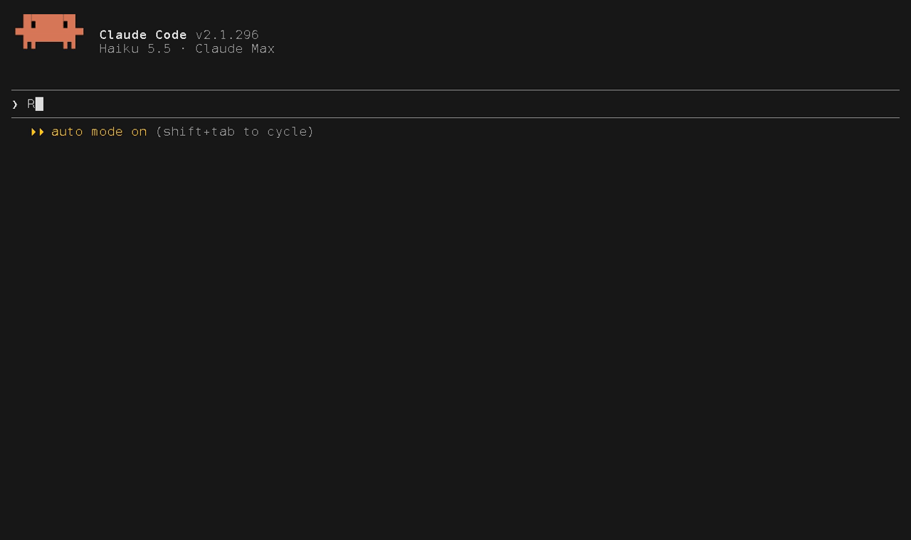

# speckit-agents

A team of six Claude Code subagents that carries a feature through
[GitHub Spec Kit](https://github.com/github/spec-kit), from idea to pull request. Each agent owns
one phase. Hooks, not prompt text, keep each one in its lane: the planner cannot write code, the
implementer cannot touch tests, and nobody writes code until an independent auditor has passed
the spec.

```
idea ─► product-owner ─► architect ─► spec-auditor ─► per slice: stubs ─► red ─► green ─► spec-gatekeeper ─► PR
        spec.md          plan.md      VERDICT:        implementer  test-writer  implementer  APPROVED /
        + questions      tasks.md     PASS / FAIL                                  │         REJECTED
           ▲                ▲              │                                       │
           └── you answer   └── findings routed back on FAIL ◄── 3 REDs in a row ──┘
```

## Contents

- [Requirements](#requirements)
- [Install](#install)
- [Quick start](#quick-start)
- [What it looks like](#what-it-looks-like)
- [Board mod (experimental)](#board-mod-experimental)
- [The team](#the-team)
- [Why This Architecture Succeeds](#why-this-architecture-succeeds)
- [How it works](#how-it-works)
- [Customising](#customising)
- [Verifying](#verifying)
- [Troubleshooting](#troubleshooting)
- [Known limits](#known-limits)
- [Uninstall](#uninstall)
- [Developing](#developing)

## Requirements

| Tool | Why | Check |
|---|---|---|
| [Claude Code](https://code.claude.com) | runs the agents. Needs subagent frontmatter `hooks:` and `skills:`, and the `UserPromptExpansion` hook event (verified on 2.1.291) | `claude --version` |
| Node 18+ | every hook is a Node script | `node --version` |
| git | the hooks use it to find the repo and diff an agent's work | `git --version` |
| Spec Kit (`specify`) | per repo, provides the phase skills | `specify --version` (verified on 0.8.11) |

Install Spec Kit with `uv tool install specify-cli --from git+https://github.com/github/spec-kit.git`.

## Install

```sh
git clone <this repo> speckit-agents && cd speckit-agents
./setup.sh                                               # macOS, Linux, Git Bash
powershell -ExecutionPolicy Bypass -File setup.ps1       # Windows PowerShell
node install.mjs                                         # anywhere Node runs
```

The installer puts everything in your user-level Claude Code directory (`$CLAUDE_CONFIG_DIR`, or
`~/.claude`), so the team is available in every repository:

| Installed file | What it is |
|---|---|
| `agents/{product-owner,architect,spec-auditor,test-writer,implementer,spec-gatekeeper}.md` | the six subagents |
| `skills/speckit-team/SKILL.md` | the `/speckit-team` command that runs the pipeline |
| `hooks/speckit-team.mjs` | every guardrail |
| `settings.json` | two hook entries merged in; your other settings and hooks are kept |

Options:

| Flag | Effect |
|---|---|
| `--dry-run` | print what would change, write nothing |
| `--force` | replace same-named agents you wrote yourself (each is kept as `*.bak-speckit-agents` and put back on uninstall) |
| `--claude-dir DIR` | install into `DIR` instead of `~/.claude` |
| `--uninstall` | remove everything the installer wrote, and nothing else |
| `--board` | also install the experimental [board mod](#board-mod-experimental); later reruns keep it |
| `--no-board` | remove the board mod and keep the team |

The installer is idempotent; rerun it after pulling changes. It changes `settings.json` in place,
keeping the file's own indentation and line endings, and updates its gate entries where they stand,
so a rerun after another tool re-sorted the file changes nothing. The first time it changes your
settings it keeps one copy of the original as `settings.json.bak-speckit-agents`. It refuses to
touch a `settings.json` that is not valid JSON or not a settings object (an array, or a `hooks`
entry that is not a list of objects), and stops before writing anything. It records what it created in
`hooks/speckit-agents.install.json`. It finishes by running the installed hook once, so a broken
Node setup fails the install instead of silently disabling the guardrails.

Restart Claude Code afterwards: agents are loaded at session start.

## Quick start

In a repository:

```sh
specify init --here --ai claude
```

Then, in Claude Code:

```
/speckit-team Let users export their reading list as CSV
```

`/speckit-team` runs the whole pipeline from the main session. It stops for you at three points:
to answer the product owner's questions, to approve the spec, and to approve the plan and tasks.
In a repo whose constitution (the rules every phase is checked against) is still Spec Kit's
template, it first drafts one from what the repo already states (`CLAUDE.md`, the build file, CI)
and asks you to approve it, a fourth stop, then writes it with `speckit-constitution`. You can
still run `/speckit-constitution` yourself beforehand.
After that it audits, then builds the feature one slice at a time (stubs, failing tests, code),
verifies and opens a PR, which it does not merge.

You can also run one phase at a time by @-mentioning an agent:

```
@agent-spec-auditor audit the active feature
@agent-implementer do T007 and T008
```

## What it looks like

Real sessions in a scratch Spec Kit repo, with Haiku standing in for every agent's model, so
your runs will word things differently. The three recordings that wait on agents are sped up 2x
or 4x. `node docs/media/record.mjs` records them again (see [Developing](#developing)).

**The team in `/agents`.** The six agents as Claude Code lists them, then the `@agent-`
typeahead you use to call one directly.


**A subagent at work.** `@agent-spec-auditor` audits a feature inside the main session: the
collapsed progress view, the full transcript with Ctrl+O, then the `VERDICT:` it hands back,
which a hook records for the implementation gate.


**A guardrail firing.** architect is told to write `src/greet.js`. Its scope hook denies the
write before the file exists, and the denial tells the agent whose lane production code is in.



**The pipeline.** `/speckit-team` launches product-owner, which writes the spec and returns its
questions, and the main session puts them to you: the first of the pipeline's three stops.


## Board mod (experimental)

`mods/speckit-board/` is a Claude Code mod (a plugin of function hooks, the early-access plugin
API of Claude Code 2.1.293) that shows where the active feature stands while the team works. The
installer adds it on request:

```sh
node install.mjs --board        # install it, for every repo and session
git pull                        # update it: then /reload-plugins, or start a new session
node install.mjs --no-board     # remove it, keep the team
```

`--board` hands the work to Claude Code's own plugin commands, in the same config directory:
`claude plugin marketplace add <this checkout>` (the repo root holds
`.claude-plugin/marketplace.json`, a marketplace named `speckit-agents`) and
`claude plugin install speckit-board@speckit-agents --scope user`. Because the marketplace is a
folder, Claude Code reads the mod from `mods/speckit-board/` in place rather than from a copy, so
an update is a `git pull` with no reinstall; `claude plugin list` shows the folder as `Read from:`.
The installer remembers the board, so a plain rerun keeps it, and `--uninstall` removes it with
the team. It removes the `speckit-agents` marketplace only if it added it. The board is read
from the checkout the installer last ran from, as the team's files are copied from it: after
moving the checkout, or to run the board from another clone or worktree, rerun the installer
there and it points the board at that folder.

To try it for one session without installing it, load it from the folder instead. If it is
installed as well, the `--plugin-dir` copy replaces the installed one for that session (Claude
Code logs `Plugin "speckit-board" from --plugin-dir overrides installed version`), so it never
runs twice.

```sh
cd <your Spec Kit repo>
claude --plugin-dir <path to this checkout>/mods/speckit-board
```

What it draws:

- **A band above the prompt**: the feature, the six phases (spec, plan, tasks, audit, build,
  verify) as `✓` done, `◐` active, `○` to do, `⊘` blocked, `✗` failed, `↻` stale, a task
  progress bar, and `RED n/3` once implementer has reported RED on the current plan.
- **A pane**, opened with `/speckit-board`: the phases, the progress bar, the retry meter, the
  team agents of this session with a spinner and elapsed time while running and their report word
  (`PASS`, `GREEN`, `APPROVED`) once done, the buttons, and last every task of `tasks.md` by
  section, the part a short terminal cuts off. `/speckit-board refresh` re-reads the files;
  `/speckit-board band` hides or shows the band.
- **A status line**, `speckit 001-greet · ○ audit · 0/6 tasks`, and toasts when the audit passes,
  fails or goes stale, the retry limit is reached, every task is ticked, or spec-gatekeeper approves.

It reads what the guardrails already keep, so it cannot disagree with the gate: `.specify/feature.json`,
the feature's `spec.md`, `plan.md` and `tasks.md`, and the verdict, retry and gatekeeper files under
`.git/speckit-team/` ([State](#state)). An audit counts as current only while the files' fingerprint
matches the one recorded with the verdict, computed exactly as `hooks/speckit-team.mjs` does
(`test/board-mod.test.mjs` holds the two together). An agent's report word comes from what it
handed back through `SubagentHandback` (how an interactive session's background agents report),
or else from its last message, as the hook reads it. The verify step reads the
spec-gatekeeper's word from the file the hook's `ends` check writes once it accepts the report,
so it updates even when the mod was reloaded or not loaded while the gatekeeper ran; it falls back
to the word the mod saw at the agent's stop, kept in its plugin store. That word counts only
while the audit is current and was recorded after the PASS; otherwise verify shows `↻` (stale),
because the gatekeeper judged files that have since changed. It refreshes every 4
seconds, after each turn, and when a team agent starts or stops. On startup it toasts either the
feature it found or that there is no `.specify/` in the repo it started in, so a loaded mod with
nothing to show is not mistaken for one that did not load.

It reads files directly rather than the documented activity stream that feature 001 specifies for
its own view (FR-016), and it covers part of what feature 002 (issue #3) specifies for the rich
view. The owner decided on 2026-10-08 (issue #11) that it stays a working prototype for those two
features, not their implementation: its layout (phase track, task progress, retry meter, agent
rows with their report word) is input to feature 002's spec, and the mod is retired once feature
001's view ships. Until then it is kept working and installable, and feature 001's spec is not
changed for it, so FR-016 binds 001's own view and not this mod. Retiring it means removing
`mods/speckit-board/`, the repo's `.claude-plugin/marketplace.json`, `--board`/`--no-board` and
the fingerprint twin in `test/board-mod.test.mjs`; `--uninstall` and `--no-board` should keep
working for one release after that, so existing installs can still remove it.

Verified: `claude plugin validate` and `claude plugin test` (18 tests, both run by `npm test`, in
CI on Linux, macOS and Windows). `--board`, a rerun, `--no-board` and `--uninstall` run the real
`claude plugin` commands against throwaway config dirs in `test/install.test.mjs`, which checks
that the mod is read from this checkout and that uninstall restores `settings.json` byte for
byte. On Windows, 2026-10-08, with the board installed from this checkout and no `--plugin-dir`:
a headless `claude -p "/speckit-board refresh"` in a scratch Spec Kit repo set the status line,
raised the startup toast and answered the command, and an interactive session (recorded with vhs)
drew the band, the status line and, after `/speckit-board`, the pane. An edit to
`mods/speckit-board/` reached the installed board at the next session start with no reinstall.
Team agent tracking, the same day, with real agents on Haiku. Headless, while
`@agent-spec-auditor` ran the status line read `◐ audit`, and when it stopped the mod toasted
`spec-auditor finished: PASS`, then `Audit PASS` once the hook had recorded the verdict;
`@agent-spec-gatekeeper` went `◐ verify`, then `spec-gatekeeper finished: APPROVED` and
`✓ verified`, which a new session still showed. Interactive, with the pane open, spec-auditor
ran as a background agent and the pane showed `spec-auditor running 19s` with the spinner, then
`✓ spec-auditor PASS`. That run found two bugs, fixed: the agent rows were drawn below the task
list and cut off, and a background agent's word was missing because its report arrives through
`SubagentHandback`. `@agent-implementer` on one task ended `implementer finished: GREEN`. Not
seen live: a `RESULT: RED` moving the retry meter (the count comes from the hook's retry file,
covered by the mod's tests; #18), and any session on macOS or Linux, where CI runs only the
tests (#19).

## The team

| Agent | Spec Kit phase | May write | Hands over | Model |
|---|---|---|---|---|
| `product-owner` | specify, clarify | `specs/`, `.specify/feature.json` | `spec.md` and up to 5 questions with recommended answers | sonnet |
| `architect` | plan, tasks | `specs/`, `CLAUDE.md` | `plan.md`, `data-model.md`, `contracts/`, `tasks.md`, with the minimal design that meets the spec | opus |
| `spec-auditor` | analyze | nothing | `VERDICT: PASS` or `FAIL`; FAIL only on CRITICAL or HIGH findings, MEDIUM and LOW are listed and accepted | opus |
| `test-writer` | TDD red | test files, `tasks.md` | committed tests, each shown failing on an assertion, never on a parse, import or compile error | sonnet |
| `implementer` | stubs, TDD green | anything except test files and `.specify/` | signature stubs (`RESULT: STUB`), or committed code with the suite green (`RESULT: GREEN` / `RED`) | sonnet |
| `spec-gatekeeper` | final check | nothing | `APPROVED` or `REJECTED`, with a requirement-to-test table | sonnet |

Each agent's phase instructions are Spec Kit's own skill (`speckit-plan` and so on), preloaded
into the agent with the `skills:` frontmatter field. The agent file adds only what Spec Kit does
not say: its inputs, its lane, and the shape of its report. Those bodies are 22 to 38 lines on
purpose.

**Why the prompts are short.** A long prompt dilutes the rules that matter, and a rule in prose
is a request. "Never edit tests" in a prompt will hold most of the time. A hook that rejects the
edit holds every time, and its rejection message tells the agent what to do instead.

**Why each agent has a narrow description.** Claude Code puts every agent's description into
every session so it can route work. These six total about 1,700 characters, roughly 420 tokens.
Each one says when to use the agent and what it will not do, so routing does not have to guess.

## Why This Architecture Succeeds

**Prevents "Garbage In, Garbage Out":** Most agent pipelines fail because the initial spec is
vague, and the coding agent fills in the blanks with hallucinations. Your product-owner forcing a
human-in-the-loop Q&A step before architecture ensures the foundation is solid.

**True TDD Validation:** LLMs are notoriously bad at writing tests for code they just wrote; they
tend to write tautological tests that just mock everything to ensure a pass. Forcing the
test-writer to write failing tests first proves the agent actually understands the acceptance
criteria.

**Circuit Breakers:** The spec-auditor acts as a firewall. If the architect designs a plan that
violates the spec, it gets kicked back before you waste tokens and time generating useless code.

**Role-Based Access Control (RBAC):** Using hooks to enforce file-system permissions per agent is
the most reliable way to orchestrate multi-agent systems today.

## How it works

### Guardrails

Everything below is enforced by `hooks/speckit-team.mjs`. In a repo without `.specify/` every
mode exits immediately and allows the action, so installing at user level costs nothing elsewhere.

| Mode | Wired to | What it stops |
|---|---|---|
| `scope only <prefixes>` | product-owner, architect: PreToolUse `Write\|Edit\|MultiEdit\|NotebookEdit` | writing outside their prefixes |
| `scope tests` | test-writer: same | writing production code |
| `scope no-tests` | implementer: same | writing test files, or Spec Kit's config under `.specify/` (`feature.json` picks the feature whose retry count applies) |
| every `scope` rule | all four writing agents | writing into the git directory (also a linked worktree's main one), where verdicts and retry counts live |
| `gate` | test-writer, implementer: PreToolUse on every tool except `SubagentHandback` | doing anything before the audit passed (reporting back is never blocked) |
| `gate retries` | implementer: the same | also a fourth attempt after 3 `RESULT: RED` reports in a row on the same plan and tasks (see [The retry limit](#the-retry-limit)) |
| `result` | implementer: PreToolUse `SubagentHandback`, and Stop | a report without a `RESULT:` line (refused once, then counted as RED); counts the result |
| `gate` | `settings.json`: PreToolUse `Skill` and `UserPromptExpansion` | `/speckit-implement`, typed by you or called by Claude, before the audit passed |
| `verdict` | spec-auditor: PreToolUse `SubagentHandback`, and Stop | a report without a `VERDICT:` line (refused once, never twice); records the verdict |
| `lane tests` / `lane no-tests` | test-writer, implementer: Stop | finishing with out-of-lane changes, including ones made through Bash or already committed |
| `ends APPROVED REJECTED` | spec-gatekeeper: PreToolUse `SubagentHandback`, and Stop | a report whose last line is not its verdict (refused once, never twice); records the accepted word |

Agent hooks live in each agent's frontmatter, so they only run while that agent is active.

A `scope` rule judges a path by where it really is: the repo and the file are both resolved through
symlinks, Windows junctions and 8.3 short names before they are compared. Paths outside the repo
are not the rule's business. Until 2026-10-08 the comparison used the path as given, so a repo
reached by another name (macOS's `/var` is `/private/var`, a short-named Windows profile such as
`C:\Users\RUNNER~1`) made every file look outside it, and every lane let the write through.

### The audit gate

When spec-auditor reports, a hook reads the last `VERDICT:` line from the report and stores it
with a fingerprint. In an interactive session the report is the `message` of the
`SubagentHandback` tool, read by a PreToolUse hook as it is sent; under `claude -p` it is the
agent's last message, read by the Stop hook. The fingerprint is a SHA-256 of the constitution, `spec.md`, `plan.md` and `tasks.md`.
The gate recomputes the fingerprint on every check. Any edit to those four files after a PASS
voids it, so the auditor has to look again. Task checkboxes are normalised before hashing, so
ticking `- [X]` while implementing does not.

The active feature comes from `.specify/feature.json`, which Spec Kit maintains. Its
`feature_directory` may be relative to the repo or absolute; either way it must name a folder
inside the repo, or the gate stays closed.

### The retry limit

An implementer that cannot make its tests pass will otherwise keep trying small tweaks, and each
attempt costs a full agent run. So every implementer report ends with `RESULT: GREEN` (its tests
and the full suite pass), `RESULT: RED` (anything else) or `RESULT: STUB` (the signatures-only
pass described under [The pipeline skill](#the-pipeline-skill)). The `result` hook counts them per
feature: GREEN resets the count, STUB leaves it, RED adds one, and a report that still has no
`RESULT:` line after one request counts as RED. A handback and the Stop that follows it are one
attempt, not two. A report made while the audit gate is closed is not counted: that implementer
never got to work.

After 3 REDs in a row, `gate retries` denies the implementer every tool except reporting back,
and says why. The count belongs to the plan and tasks it was made on (the audit fingerprint), so
the way forward is to send the failing task to the architect: the revised `plan.md` or `tasks.md`
needs a new audit and starts the count from zero. Or the user decides, and to retry unchanged
deletes `.git/speckit-team/retries/<feature>.json`. A retry record that cannot be read keeps the
gate shut, like an unreadable verdict. The limit is `MAX_RED` in `hooks/speckit-team.mjs`.

### The lane check

The write hooks see `Write` and `Edit`, but an agent can also change files with
`sed -i` through Bash. So on the first tool call, the gate records the agent's starting commit
and the files already dirty. When the agent stops, `lane` diffs everything since then, committed
or not, and blocks the stop if any changed file is outside the lane. The agent is told which
files to restore. Files that were dirty before the agent started are ignored. If the agent stops
a second time with the problem still there, the hook lets it finish with a WARNING rather than
loop.

### Test files

A path counts as a test if it matches one of:

- a directory segment `test/`, `tests/`, `__tests__/`, `testing/`, `testdata/`, `fixtures/`, `e2e/`, `spec/`
- `src/it/`, `src/integrationTest/`, `src/testFixtures/`
- `test_*.py`, `*_test.{go,py,rs,exs,dart,c,cc,cpp}`, `*.{test,spec}.{js,ts,jsx,tsx,mjs,cjs,mts,cts}`
- `*{Test,Tests,IT,Spec}.{java,kt,kts,groovy,scala,cs}`, `*_spec.rb`, `*Test.swift`, `*Tests.swift`

Plus every regex line in the repo's `.specify/test-paths` (see below).

### State

Verdicts, retry counts, the gatekeeper's last word and per-agent start points live in
`$(git rev-parse --git-common-dir)/speckit-team/` (`verdicts/`, `retries/`, `ends/` per feature, `agents/`).
That is inside `.git`, so it is never committed, and it is shared by every worktree of the repo,
which lets parallel implementers in worktrees pass the same gate.

### The pipeline skill

`/speckit-team` runs in the main session, because only the main session can talk to you. It
launches each agent with the inputs it needs and relays the product owner's questions to you. On
a FAIL it routes each CRITICAL and HIGH finding to the agent that owns it; MEDIUM and LOW findings
are accepted and listed once at hand-over. On a REJECTED it routes each reason the same way. After
two failed audits it hands the findings to you.

After the audit it builds the feature one slice at a time, never in one shot. A slice is one small
implementation task plus the test tasks that cover it, and the architect writes `tasks.md` in
those slices. For each slice:

1. **Stubs.** If the tests will call code that does not exist yet, implementer first creates the
   signatures the task lists, with bodies that only signal "not implemented", and reports
   `RESULT: STUB`. This is what lets the next step fail cleanly.
2. **Red.** test-writer writes the slice's tests and loops until each one fails on an assertion
   or on the stub's not-implemented signal. A test that fails because it does not parse, an
   import is missing or a name is undefined proves nothing about the behaviour, so test-writer
   fixes it (at most 3 rounds per test) and the skill sends back any that still fail that way.
3. **Green.** implementer makes the slice's tests pass, under the [retry limit](#the-retry-limit).

For `[P]` slices touching disjoint files, it can run several loops at once, each implementer in its
own git worktree.

When the last slice is GREEN and every task in `tasks.md` is ticked, it launches spec-gatekeeper
straight away, in the foreground, without asking: between the stops above it never waits for you.

**Handoffs are lossy on purpose.** A subagent never sees the main session's conversation; it
starts with the prompt the skill writes and whatever files it reads. So the skill passes each
agent only what its Inputs section lists, and never the chat, the product owner's questions and
answers, or another agent's full report. implementer gets the slice's task IDs and test-writer's
report for them, and its own prompt tells it to read `tasks.md`, the failing tests and the code
they touch, not `spec.md`, `plan.md`, `research.md` or `data-model.md`. The tests are its spec.

**Context budget.** Measured from the transcripts of the 001 run (2026-10-06 and 2026-10-07):

| Agent run | Requests | Peak context | Cause |
|---|---|---|---|
| one architect, sent 6 follow-up tasks across 4 audit rounds | 729 | 726k tokens | kept alive with SendMessage; read `tasks.md` 76 times, `research.md` 49, `plan.md` 40 |
| product-owner, the same way | 86 | 77k | 9 follow-up tasks |
| each spec-auditor (4 runs) | 32 to 73 | 121k to 210k | read every artifact whole: 184k to 361k characters of tool results; reports of up to 13k characters |
| a fresh agent before it reads anything | 1 | 11k to 14k | Claude Code's system prompt, tools and your own `CLAUDE.md` |

So the skill launches a fresh agent for every phase and every fix round, and never sends a new
task to an old one. The architect reads each artifact once and edits by grep; on a revision it
reads only what the findings point to. spec-auditor reads the constitution, spec, plan and tasks
once each, greps the other artifacts, and keeps its report to 60 lines. test-writer greps the spec
for the IDs its tasks cite instead of reading it whole. These are prompt rules, not hooks. On the
small scratch feature in the 2026-10-07 live check, spec-auditor read the four files once each and
peaked at 13k tokens; a feature the size of 001 has not been re-measured.

Two full `/speckit-team` runs of the same small feature (a `sum()` function, 3 slices; Opus
architect and auditor, Sonnet for the rest and the main session) show where the rest goes. Every
agent started fresh and peaked at 16k to 49k tokens. The main session is the larger cost: it
starts at about 41k (Claude Code, your tools and `CLAUDE.md`), and every report it receives stays
in its context for each later request. Capping each report's length and fixing two bugs (below)
between the runs gave:

| Run | Agents launched | Main session peak | Tokens read, main / agents | Cost |
|---|---|---|---|---|
| before the report limits | 19 | 95.7k | 4.63M / 3.92M | $3.98 |
| after | 17 | 85.5k | 3.97M / 2.78M | $2.87 |

Runs differ in how many audit rounds they need, so read this as one sample, not a benchmark.

The failure-reason check in step 2 is prose: the hooks cannot tell an assertion failure from a
compile error in an arbitrary language, so the skill checks test-writer's pasted output.

## Customising

- **Test layout the patterns miss:** add one JavaScript regex per line to `.specify/test-paths`
  in that repo. Lines starting with `#` are comments. A line that is not a valid regex stops
  test-writer and implementer from writing anything until it is fixed, and the message names it.

  ```
  # golden files are tests too
  ^checks/golden/
  ```

- **Models:** edit `model:` in `agents/*.md` and rerun the installer. Use `inherit` to follow the
  session's model.
- **More or fewer implementer attempts:** `MAX_RED` in `hooks/speckit-team.mjs` (default 3).
- **A stricter or looser PASS:** spec-auditor's "Verdict" section in `agents/spec-auditor.md`.
  By default only CRITICAL and HIGH findings fail an audit.
- **How much design the architect adds:** step 2 of `agents/architect.md` asks for the minimal
  design and no recovery machinery unless a requirement or constitution rule demands it.
- **Edit the source, not the installed copy.** Installed files carry a
  `speckit-agents: managed by install.mjs` marker, and the next install overwrites them.

## Verifying

`npm test` runs 48 tests: 32 drive the hook with hook JSON on stdin against throwaway git repos,
16 run the installer against throwaway config dirs. They prove the logic. They cannot prove that
Claude Code fires a hook, which is where all three serious bugs in this project were. After changing a
hook command, an event name or a matcher, check it live in a scratch repo:

```sh
mkdir /tmp/sk && cd /tmp/sk && git init && specify init --here --ai claude
# commit, then, with no audit recorded:
MSYS_NO_PATHCONV=1 claude -p "/speckit-implement" --output-format json
```

Expect `"num_turns":0` and `"total_cost_usd":0`, meaning the gate stopped it before any model
call. (`MSYS_NO_PATHCONV=1` matters only in Git Bash, which otherwise rewrites `/speckit-implement`
into `C:/Program Files/Git/speckit-implement`.)

Live results on 2026-10-06 (Claude Code 2.1.291, Windows 11, Haiku subagents):

- typed `/speckit-implement` with no audit: blocked at 0 turns, $0
- architect's `Write` to `src/`: denied, file not created
- implementer's first `Bash` call before an audit: denied by the gate
- spec-auditor's `VERDICT: PASS`: recorded by its Stop hook

Live results on 2026-10-07 (Claude Code 2.1.292, Windows 11, Haiku subagents, user-level install):

- implementer before an audit: its `Bash` call denied by `gate retries`, and its RED not counted
- 3 implementer runs ending `RESULT: RED`: counted once each, 3 IDs in the retry record
- a fourth implementer run: its `Bash` call denied with the retry-limit message, its report still delivered
- one slice (test-writer on T001, then implementer on T002): the tests failed on the stub's
  "not implemented" error, implementer turned them green, each committed only in-lane files, and
  its `RESULT: GREEN` reset the count through the SubagentStop hook
- two full `/speckit-team` runs of a small feature, all six agents: spec, 1 audit FAIL and a
  revision, PASS, 3 slices, gatekeeper. They found two bugs, both fixed: a stub-only task was never
  ticked, so the gatekeeper rejected the feature; and a gatekeeper handed back the report
  "placeholder" in the same turn as a tool call, so a second gatekeeper had to run. `ends` now
  refuses such a report once.

Not yet exercised live: implementer's test-file denial and a lane violation (a clean lane check
did run). Those are covered by the unit tests only.

## Troubleshooting

**The gates do nothing.** A hook that crashes counts as a non-blocking error, so the action goes
through and nothing tells you. Check that `node` is on the PATH Claude Code sees, then run
`claude --debug hooks` and look for `speckit-team.mjs` errors. This happened once already: hook
commands written with `$HOME` expanded to `/c/Users/...`, which `node` on Windows resolves to
`C:\c\Users\...`. The installer therefore writes a quoted absolute path. Do not hand-edit it into
`$HOME` or `~`.

If the agents come from a project's `.claude/` (an install with `--claude-dir <repo>/.claude`)
rather than your user directory, Claude Code skips their frontmatter hooks until that folder has
been trusted, and says so only in the debug log: `Skipping frontmatter hooks for agent
'implementer': the folder its definition file came from is not trusted`. Open Claude Code in that
folder once and accept the trust dialog. Seen on Claude Code 2.1.292, where the scratch repo's
implementer ran Bash with no audit recorded and the gate never fired.

**An agent cannot report back, or a verdict is never recorded.** Subagents in an interactive
session report through the `SubagentHandback` tool, not their last message. A hook that matches
every tool (`.*`) also matches that one: before 2026-10-06 the gate denied it, so a gated agent
retried its report until it gave up, and spec-auditor's verdict, read from the last message, was
never found. The gate now lets `SubagentHandback` through and the verdict is read from its
`message`. Any new catch-all hook must do the same.

**`/speckit-implement` is not gated.** A typed slash command fires `UserPromptExpansion`, not
`UserPromptSubmit`, and a PreToolUse `Skill` hook only sees Claude calling the skill. Both entries
must be in `settings.json`; rerun the installer if a tool that rewrites `settings.json` dropped
them.

**"spec-auditor has not passed".** Run `@agent-spec-auditor`. If it passed and you then edited
the spec, plan, tasks or constitution, the PASS is void by design: run it again.

**"Retry limit: implementer reported RESULT: RED 3 times in a row".** The plan or tasks need
rethinking: send the failing task to the architect and re-audit, which resets the count. To retry
without changes, delete the file the message names.

**An agent is blocked writing a legitimate test file.** Add a pattern to `.specify/test-paths`.

**"may not write ... until the test patterns can be read".** A line in `.specify/test-paths` is
not a valid JavaScript regex. Fix the line the message names; until then the test lanes cannot
tell a test from production code, so they refuse every write.

**Install fails with "not installed by speckit-agents".** You already have an agent with one of
these six names. Rename yours, or pass `--force` to back it up and replace it.

## Known limits

- **Hooks fail open.** If Node is missing or the script cannot start, the action is allowed. The
  installer's smoke check and the live check above are the defences. Input the hook cannot use
  (not JSON, not an object, an event the mode is not wired for) also lets the action through, but
  never silently: the hook makes no decision and shows a `speckit-team: ... no decision made`
  message. The same holds for fields of the wrong type and for any unforeseen error: a safety net
  turns every crash into no decision plus a `speckit-team: ... internal error` message. One case
  fails closed instead: a verdict file that cannot be read proves no PASS, so the gate stays shut
  and says why. Until 2026-10-06 the hook crashed on all of these, which allowed the action
  without a word.
- **Inline tests can't be told apart.** Tests that live inside production files (Rust
  `#[cfg(test)]`) can't be identified by path.
- **Read-only isn't airtight.** spec-auditor and spec-gatekeeper have no Write or Edit tools,
  but Bash could still write a file. Likewise the git-directory guard stops `Write` and `Edit`
  (in any spelling Windows folds together, through symlinks, and from a linked worktree), not `rm`
  through Bash.
- **Subagents can't ask you questions.** product-owner returns its questions, and the main
  session asks them.
- **A preloaded skill pulls in its whole phase.** An architect asked to do one small thing will
  tend to run all of `speckit-plan`.
- **The team never merges.** It stops at the PR.

## Uninstall

```sh
node install.mjs --uninstall
```

This removes the six agents, the skill, the hook and both `settings.json` entries, and leaves
nothing of the installer's behind:

- **Settings:** if nothing else changed your `settings.json` since the install, its original bytes
  are written back, CRLF and inline arrays included. If something did (another tool, you), that
  change is kept and only the gates are removed, in the file's own format. Your own empty
  `"hooks": {}` or event lists are kept. No backup is made at uninstall, and the install-time copy
  is deleted.
- **Files:** only files that carry the installer's marker are removed; a same-named file you wrote
  is left alone. An agent that `--force` replaced is put back.
- **Directories:** only `agents/`, `hooks/` or `skills/` that the install created, and only if
  they are empty.
- **The board mod**, if `--board` installed it: removed with `claude plugin uninstall`, and the
  `speckit-agents` marketplace with it when the installer added it. Claude Code's own state for it
  (under `plugins/`) is Claude Code's to keep. Without `claude` on PATH the uninstall warns, prints
  the two commands to run by hand, and removes the rest.

Audit state stays in each repo's `.git/speckit-team/`, which is safe to delete. An install made
before the record file existed has no record of what it created, so its uninstall keeps every
directory and leaves any older `*.bak-speckit-agents-<time>` backups in place.

## Developing

CI runs `npm test` on Linux, macOS and Windows for every pull request
(`.github/workflows/test.yml`).

See `CLAUDE.md`. In short: edit `agents/`, `hooks/`, `skills/` or `install.mjs`, run `npm test`,
rerun the installer, and do the live check if you touched how a hook is wired.

The GIFs under [What it looks like](#what-it-looks-like) come from the
[vhs](https://github.com/charmbracelet/vhs) tapes in `docs/media/`. To record them again, with
vhs, `specify`, `claude` and git on your PATH:

```sh
node docs/media/record.mjs                 # all four; makes live Haiku calls
node docs/media/record.mjs pipeline        # only the named tapes
node docs/media/record.mjs --setup-only    # build the scratch repo, record nothing
```

The script builds a scratch Spec Kit repo in `~/.cache/speckit-agents-demo` (owner-only, not a
shared temp dir, because it gets folder trust) with the demo feature in
`docs/media/demo/`, installs the team into that repo's `.claude/`, and starts Claude Code with
`--setting-sources project,local --strict-mcp-config`, so your own hooks, plugins, statusline and
MCP servers stay out of the frame. Look at every GIF before committing it: the session banner can
still show account details.
